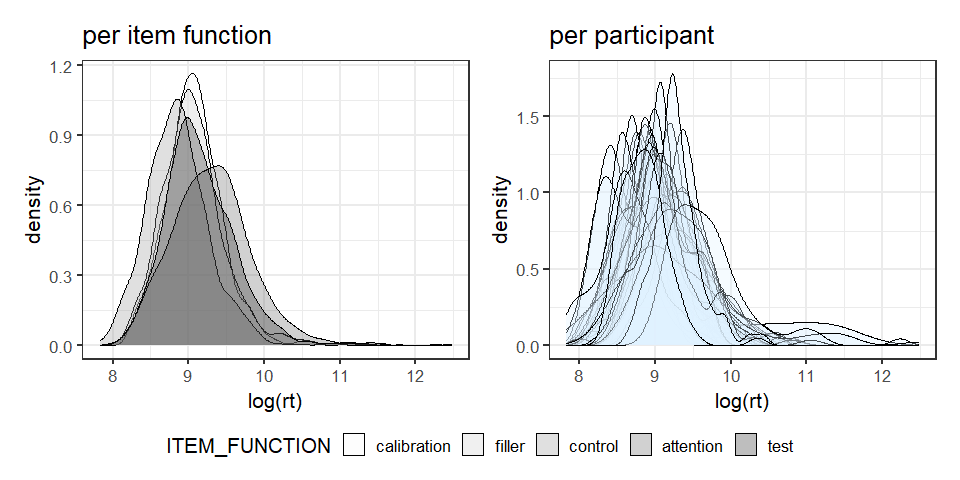
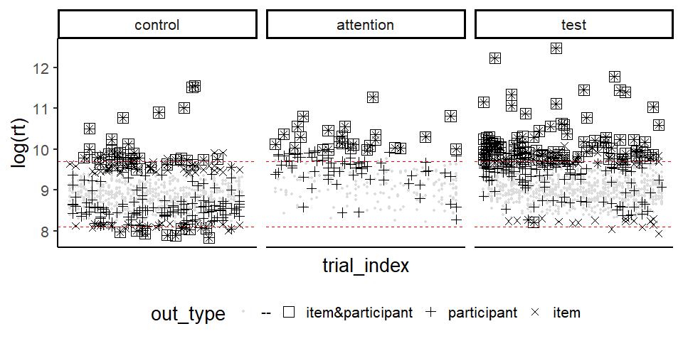
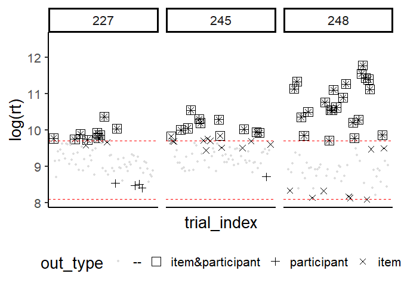
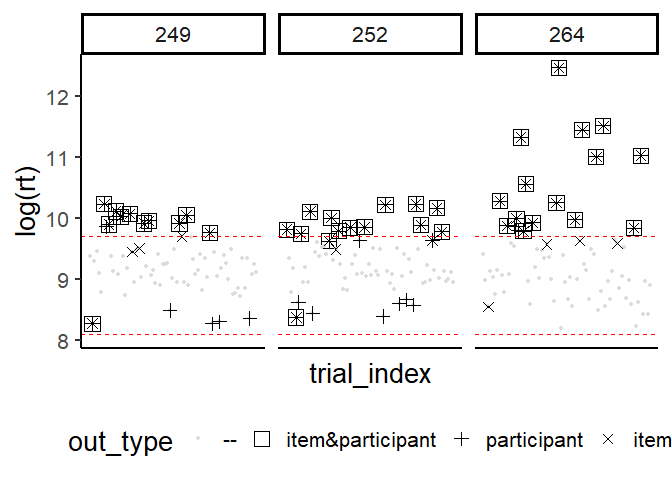
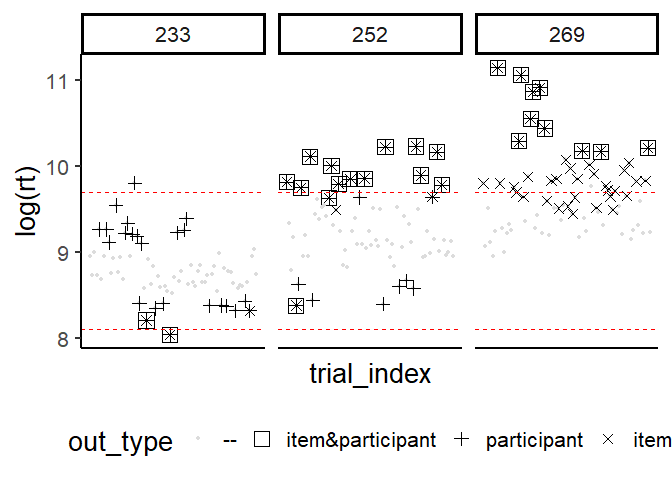

Read in questionnaire:


```r
filler_items = read.csv(
  "./judgments/all/ForcedChoice_filler.csv", fileEncoding = "UTF-8")
test_items = read.csv("./judgments/all/ForcedChoice_test.csv", fileEncoding = "UTF-8") %>% 
  mutate(ITEM_FUNCTION = "test")
questionnaire = bind_rows(filler_items, test_items) %>%
   mutate_at(.vars = c("ITEM_FUNCTION", "workerId"), .funs = as_factor) 
```


# Progress (incomplete submissions) 

We require that at least 90\% of the questionnaire has been completed. 
(Note: we assume that there are no missing trials due to data loss / technical errors).


```r
available_trials = questionnaire %>%
  group_by(workerId) %>%
  summarise(trials = n(), 
            trials_prop = n()/length(unique(questionnaire$trial_index))) %>%
  mutate(accept = ifelse(trials_prop < 0.9, FALSE, TRUE)) %>%
  arrange(trials_prop)
```

Let's check whether there are participants that left the questionnaire prematurely:


```r
available_trials %>% filter(trials_prop < 1) %>% kable() 
```

<table class="table table-striped" style="width: auto !important; margin-left: auto; margin-right: auto;">
 <thead>
  <tr>
   <th style="text-align:left;"> workerId </th>
   <th style="text-align:right;"> trials </th>
   <th style="text-align:right;"> trials_prop </th>
   <th style="text-align:left;"> accept </th>
  </tr>
 </thead>
<tbody>
  <tr>

  </tr>
</tbody>
</table>


Remove incomplete data from questionnaire:


```r
 questionnaire = questionnaire %>%
   filter(!(workerId %in% (
     available_trials %>% filter(accept == FALSE) %>% pull(workerId)
   )))
```


# Latency-based identification 


## Spammers

We will reject workers with *mean*(RT) < 3000 ms (as simple spammers) and those  with *median*(RT) < 3000 ms (as clever spammers):


```r
simple_spammer = questionnaire %>%
                         group_by(workerId) %>%
                         summarise(score = mean(rt)) %>%
                         mutate(criterion = "meanRT", 
                                accept = ifelse(score < 3000, FALSE, TRUE))
```

Are there any simple spammers?

```r
simple_spammer %>% filter(accept == FALSE) %>% kable() 
```

<table class="table table-striped" style="width: auto !important; margin-left: auto; margin-right: auto;">
 <thead>
  <tr>
   <th style="text-align:left;"> workerId </th>
   <th style="text-align:right;"> score </th>
   <th style="text-align:left;"> criterion </th>
   <th style="text-align:left;"> accept </th>
  </tr>
 </thead>
<tbody>
  <tr>

  </tr>
</tbody>
</table>


```r
clever_spammer = questionnaire %>%
                         group_by(workerId) %>%
                         summarise(score = median(rt)) %>%
                         mutate(criterion = "medianRT", 
                                accept = ifelse(score < 3000, FALSE, TRUE))
```

Are there any clever spammers?

```r
clever_spammer %>% filter(accept == FALSE) %>% kable() 
```

<table class="table table-striped" style="width: auto !important; margin-left: auto; margin-right: auto;">
 <thead>
  <tr>
   <th style="text-align:left;"> workerId </th>
   <th style="text-align:right;"> score </th>
   <th style="text-align:left;"> criterion </th>
   <th style="text-align:left;"> accept </th>
  </tr>
 </thead>
<tbody>
  <tr>

  </tr>
</tbody>
</table>


## RT distributions

Participants and different (groups of) items presumably exhibit different RT distributions:


```r
rt_density_worker = questionnaire %>%
  ggplot(aes(x=log(rt), group = workerId)) + 
  geom_density(alpha=.3, fill = "#DFF1FF")

rt_density_item_funs = questionnaire %>% 
  ggplot(aes(x = log(rt), fill=ITEM_FUNCTION)) +
  geom_density(alpha=.3) + 
  scale_fill_brewer(palette = "Greys")
```
  


The more diverse the distribution the stronger is the superiority of ReMFOD (see next chapter) above generic cutoff points for outlier detection. 

## Underperforming 

**Recursive multi-factorial outlier detection (ReMFOD , @Pieper_et_al_2022)**

```r
source("./R Sources/ReMFOD.R")
```

ReMFOD (see [source code](./R Sources/ReMFOD.R)) aims at identifying individual trials as genuine intermissions  and rushes. In doing so, ReMFOD accounts for different RT distributions of different participants and item functions, as well as swamping and masking effects. Underpinned by these suspicious individual trials, underperforming participants can be determined by means of proportion of trials not responded to wholeheartedly. We propose to discard participants who have responded genuinely to less than 90~\% of trials because they supposedly did not meet the task with the necessary seriousness.

To account for different RT distributions, ReMFOD compares the RT of each trial to a lower and an upper cutoff point, which each consider two  cutoff criteria, respectively: The first criterion  is computed with respect to the group of trials with the same *item function* (i.e. attention trials only, control trials only, etc.) regardless of the participant responding, the second one is computed with respect to  all trials of the corresponding participant (regardless of the item function). Only if an RT surmounts or  falls below *both*  criteria, it will be designated as a *genuine intermission*
or as a *genuine rush*.[^1]

[^1]: @Miller_1991 proposes the values of 3 (very conservative), 2.5 (moderately conservative) or even 2 (poorly
conservative).  @Haeussler_Juzek_2016 suggest using an asymmetric criterion (using standard deviations) of -1.5 for the lower and +4 for the upper cutoff point.

\begin{align}    \label{eq:cutoff_outlier_rt}
    \textit{cutoff_}&\textit{intermission} = \max \left\{  \right.\\
&\left. \text{median}(\textit{RTs:participant}) + 2.5 \times \text{mad}(\textit{RTs:participant}), \right.\nonumber\\
 &\left. \text{median}(\textit{RTs:item_function}) + 2.5 \times \text{mad}(\textit{RTs:item_function})\right.\nonumber\}
\end{align}

\begin{align}  \label{eq:cutoff_guesses_rt}
    \textit{cutoff_}&\textit{rush} = \min \left\{  \right.\\
&\left. \text{median}(\textit{RTs:participant}) - 1.5 \times \text{mad}(\textit{RTs:participant}), \right.\nonumber\\
 &\left. \text{median}(\textit{RTs:item_function}) - 1.5 \times \text{mad}(\textit{RTs:item_function})\right.\nonumber\}
\end{align}

To account for swamping and masking effects (see @Ben-Gal_2005), 
the process described above will be repeated on a reduced data set (i.e. excluding already detected outliers) until no more outliers  can be found. Therefore, in each iteration step, the cutoff points must be computed afresh. 


### Overview plot for item functions

Different outlier types, computed with respect to different groups, are marked by different shapes: Box-shaped trials are the only RTs we consider as genuine intermissions or rushes. Note that the shapes may overlap as these outliers have been computed by various procedures differing in the groups they included to identify outliers.


```r
## compute different outlier types based on the whole questionnaire and plot these
remfod_plot = questionnaire  %>% outlier_plots_remfod()
item_plot = remfod_plot # we are going to reuse remfod_plot for workers
## remove data we are currently not interested in from the plot 
item_plot$data = item_plot$data %>% 
  filter(!ITEM_FUNCTION %in% c("calibration", "filler"))
## structure plot as you like
item_plot + facet_wrap(~ ITEM_FUNCTION, nrow = 1)
```




### Performance of participants

We expect that 90 % of the trials are answered without genuine intermission or rushes, i.e. that 90 % of the RTs are *valid*


```r
rt_outlier_count = remfod(questionnaire)  %>% 
  group_by(workerId,  direction) %>% tally() %>%
  spread(key = "direction", value = "n") %>% 
  rename( none = "<NA>") %>%  
  mutate_if(is.numeric, replace_na, 0) %>%
  mutate(trials_total = sum(long, short, none),
         prop_long = long/trials_total, 
         prop_short = short/trials_total,
         prop_out = (short+long)/trials_total,
         prop_valid = none/trials_total,
         accept = ifelse(prop_valid < 0.9, FALSE, TRUE)) %>%
  arrange(prop_valid) %>%
  mutate_if(is.numeric, round, 4)
```


```{=html}
<div id="htmlwidget-40238316192d7782d32d" style="width:100%;height:auto;" class="datatables html-widget"></div>
<script type="application/json" data-for="htmlwidget-40238316192d7782d32d">{"x":{"filter":"none","vertical":false,"extensions":["Buttons"],"data":[["248","264","252","245","249","269","227","221","243","253","254","256","263","268","223","255","220","236","238","246","258","266","270","234","237","244","267","222","228","229","232","239","241","230","233","235","240","247","231","242","271","224","225","251","257"],[22,15,13,11,10,10,9,7,7,6,7,7,1,7,6,6,5,5,3,5,5,5,5,4,4,4,4,2,3,1,3,3,3,2,0,1,2,2,1,1,1,0,0,0,0],[0,0,1,0,1,0,0,0,0,1,0,0,6,0,0,0,0,0,2,0,0,0,0,0,0,0,0,1,0,2,0,0,0,0,2,1,0,0,0,0,0,0,0,0,0],[50,57,58,61,61,62,63,65,65,65,65,65,65,65,66,66,67,67,67,67,67,67,67,68,68,68,68,69,69,69,69,69,69,70,70,70,70,70,71,71,71,72,72,72,72],[72,72,72,72,72,72,72,72,72,72,72,72,72,72,72,72,72,72,72,72,72,72,72,72,72,72,72,72,72,72,72,72,72,72,72,72,72,72,72,72,72,72,72,72,72],[0.3056,0.2083,0.1806,0.1528,0.1389,0.1389,0.125,0.0972,0.0972,0.0833,0.0972,0.0972,0.0139,0.0972,0.0833,0.0833,0.0694,0.0694,0.0417,0.0694,0.0694,0.0694,0.0694,0.0556,0.0556,0.0556,0.0556,0.0278,0.0417,0.0139,0.0417,0.0417,0.0417,0.0278,0,0.0139,0.0278,0.0278,0.0139,0.0139,0.0139,0,0,0,0],[0,0,0.0139,0,0.0139,0,0,0,0,0.0139,0,0,0.0833,0,0,0,0,0,0.0278,0,0,0,0,0,0,0,0,0.0139,0,0.0278,0,0,0,0,0.0278,0.0139,0,0,0,0,0,0,0,0,0],[0.3056,0.2083,0.1944,0.1528,0.1528,0.1389,0.125,0.0972,0.0972,0.0972,0.0972,0.0972,0.0972,0.0972,0.0833,0.0833,0.0694,0.0694,0.0694,0.0694,0.0694,0.0694,0.0694,0.0556,0.0556,0.0556,0.0556,0.0417,0.0417,0.0417,0.0417,0.0417,0.0417,0.0278,0.0278,0.0278,0.0278,0.0278,0.0139,0.0139,0.0139,0,0,0,0],[0.6944,0.7917,0.8056,0.8472,0.8472,0.8611,0.875,0.9028,0.9028,0.9028,0.9028,0.9028,0.9028,0.9028,0.9167,0.9167,0.9306,0.9306,0.9306,0.9306,0.9306,0.9306,0.9306,0.9444,0.9444,0.9444,0.9444,0.9583,0.9583,0.9583,0.9583,0.9583,0.9583,0.9722,0.9722,0.9722,0.9722,0.9722,0.9861,0.9861,0.9861,1,1,1,1],[false,false,false,false,false,false,false,true,true,true,true,true,true,true,true,true,true,true,true,true,true,true,true,true,true,true,true,true,true,true,true,true,true,true,true,true,true,true,true,true,true,true,true,true,true]],"container":"<table class=\"display\">\n  <thead>\n    <tr>\n      <th>workerId<\/th>\n      <th>long<\/th>\n      <th>short<\/th>\n      <th>none<\/th>\n      <th>trials_total<\/th>\n      <th>prop_long<\/th>\n      <th>prop_short<\/th>\n      <th>prop_out<\/th>\n      <th>prop_valid<\/th>\n      <th>accept<\/th>\n    <\/tr>\n  <\/thead>\n<\/table>","options":{"dom":"Blfrtip","pageLength":5,"searching":false,"buttons":["csv","excel","pdf"],"columnDefs":[{"className":"dt-right","targets":[1,2,3,4,5,6,7,8]}],"order":[],"autoWidth":false,"orderClasses":false,"lengthMenu":[5,10,25,50,100]}},"evals":[],"jsHooks":[]}</script>
```


#### Plots of individual participants

Some underperforming participants

<!-- --><!-- -->

***
Further exemplative workers




# Item-based identification 


```r
control_trials = questionnaire %>% 
  filter(ITEM_FUNCTION == "control")  %>%
  droplevels()

attention_trials = questionnaire %>% 
  filter(ITEM_FUNCTION == "attention")  %>%
  droplevels()
```

Each control group should provide chances of less than 5% to pass controls by guessing. 

## Guessing probabilities  

```r
source("./R Sources/GuessingProbs.R")
```

To compute the probability (by standard binomial expansions) of (*exactly!*) k correct answers out of N trials, where 

- ***k*** amount of trials answered correctly
- ***N*** mount of total trials
- ***p*** the probability of a correct response
- ***q*** the probability of an incorrect response
- ***p == q***, i.e. there are only two choices

we can use the simplified formula  (see @Frederick_Speed_2007), implemented by the  function `k_out_of_N`:

\begin{align}
 \frac{N!}{k!(N - k)!}p^{N}
 \label{eq:probs_binomial_2choices}
\end{align}

To compute the probability (by standard binomial expansions) of k *or fewer* correct answers out of N trials, we can use the function `k_out_of_N_cumulative`, which returns the sum of all the probabilities from 0 to k  (see [source code](./R Sources/GuessingProbs.R)).


## Criterion selection

Each control group should provide chances of less than 5% to pass controls by guessing. 

Let's look at the chances to answer **at least** k out of N items correct for different ks and Ns:


```r
k_out_of_N_matrix_cumulative(Ns = seq(4,16,2), ks = c(2:12))
```

<table class="table table-striped" style="width: auto !important; margin-left: auto; margin-right: auto;">
<caption>Table 2 in @Pieper_et_al_2022</caption>
 <thead>
  <tr>
   <th style="text-align:right;"> N\k </th>
   <th style="text-align:right;"> 2 </th>
   <th style="text-align:right;"> 3 </th>
   <th style="text-align:right;"> 4 </th>
   <th style="text-align:right;"> 5 </th>
   <th style="text-align:right;"> 6 </th>
   <th style="text-align:right;"> 7 </th>
   <th style="text-align:right;"> 8 </th>
   <th style="text-align:right;"> 9 </th>
   <th style="text-align:right;"> 10 </th>
   <th style="text-align:right;"> 11 </th>
   <th style="text-align:right;"> 12 </th>
  </tr>
 </thead>
<tbody>
  <tr>
   <td style="text-align:right;font-weight: bold;"> 4 </td>
   <td style="text-align:right;"> 0.688 </td>
   <td style="text-align:right;"> 0.312 </td>
   <td style="text-align:right;"> 0.062 </td>
   <td style="text-align:right;">  </td>
   <td style="text-align:right;">  </td>
   <td style="text-align:right;">  </td>
   <td style="text-align:right;">  </td>
   <td style="text-align:right;">  </td>
   <td style="text-align:right;">  </td>
   <td style="text-align:right;">  </td>
   <td style="text-align:right;">  </td>
  </tr>
  <tr>
   <td style="text-align:right;font-weight: bold;"> 6 </td>
   <td style="text-align:right;"> 0.891 </td>
   <td style="text-align:right;"> 0.656 </td>
   <td style="text-align:right;"> 0.344 </td>
   <td style="text-align:right;"> 0.109 </td>
   <td style="text-align:right;"> 0.016 </td>
   <td style="text-align:right;">  </td>
   <td style="text-align:right;">  </td>
   <td style="text-align:right;">  </td>
   <td style="text-align:right;">  </td>
   <td style="text-align:right;">  </td>
   <td style="text-align:right;">  </td>
  </tr>
  <tr>
   <td style="text-align:right;font-weight: bold;"> 8 </td>
   <td style="text-align:right;"> 0.965 </td>
   <td style="text-align:right;"> 0.855 </td>
   <td style="text-align:right;"> 0.637 </td>
   <td style="text-align:right;"> 0.363 </td>
   <td style="text-align:right;"> 0.145 </td>
   <td style="text-align:right;"> 0.035 </td>
   <td style="text-align:right;"> 0.004 </td>
   <td style="text-align:right;">  </td>
   <td style="text-align:right;">  </td>
   <td style="text-align:right;">  </td>
   <td style="text-align:right;">  </td>
  </tr>
  <tr>
   <td style="text-align:right;font-weight: bold;"> 10 </td>
   <td style="text-align:right;"> 0.989 </td>
   <td style="text-align:right;"> 0.945 </td>
   <td style="text-align:right;"> 0.828 </td>
   <td style="text-align:right;"> 0.623 </td>
   <td style="text-align:right;"> 0.377 </td>
   <td style="text-align:right;"> 0.172 </td>
   <td style="text-align:right;"> 0.055 </td>
   <td style="text-align:right;"> 0.011 </td>
   <td style="text-align:right;"> 0.001 </td>
   <td style="text-align:right;">  </td>
   <td style="text-align:right;">  </td>
  </tr>
  <tr>
   <td style="text-align:right;font-weight: bold;"> 12 </td>
   <td style="text-align:right;"> 0.997 </td>
   <td style="text-align:right;"> 0.981 </td>
   <td style="text-align:right;"> 0.927 </td>
   <td style="text-align:right;"> 0.806 </td>
   <td style="text-align:right;"> 0.613 </td>
   <td style="text-align:right;"> 0.387 </td>
   <td style="text-align:right;"> 0.194 </td>
   <td style="text-align:right;"> 0.073 </td>
   <td style="text-align:right;"> 0.019 </td>
   <td style="text-align:right;"> 0.003 </td>
   <td style="text-align:right;"> 0.000 </td>
  </tr>
  <tr>
   <td style="text-align:right;font-weight: bold;"> 14 </td>
   <td style="text-align:right;"> 0.999 </td>
   <td style="text-align:right;"> 0.994 </td>
   <td style="text-align:right;"> 0.971 </td>
   <td style="text-align:right;"> 0.910 </td>
   <td style="text-align:right;"> 0.788 </td>
   <td style="text-align:right;"> 0.605 </td>
   <td style="text-align:right;"> 0.395 </td>
   <td style="text-align:right;"> 0.212 </td>
   <td style="text-align:right;"> 0.090 </td>
   <td style="text-align:right;"> 0.029 </td>
   <td style="text-align:right;"> 0.006 </td>
  </tr>
  <tr>
   <td style="text-align:right;font-weight: bold;"> 16 </td>
   <td style="text-align:right;"> 1.000 </td>
   <td style="text-align:right;"> 0.998 </td>
   <td style="text-align:right;"> 0.989 </td>
   <td style="text-align:right;"> 0.962 </td>
   <td style="text-align:right;"> 0.895 </td>
   <td style="text-align:right;"> 0.773 </td>
   <td style="text-align:right;"> 0.598 </td>
   <td style="text-align:right;"> 0.402 </td>
   <td style="text-align:right;"> 0.227 </td>
   <td style="text-align:right;"> 0.105 </td>
   <td style="text-align:right;"> 0.038 </td>
  </tr>
</tbody>
</table>


To determine the amount of trials that participants are required to respond to correctly, we only need the number of attention trials employed in this study. Our rule of thumb is that chances to pass this test by chance (i.e. guessing) must not succeed 5%. We use the function `find_k_min(N)`  which return the minimal requirement of all valid options, or the best possible requirement. 


## Evaluation groups

There are different ways to proceed: we could evaluate attention and control items as one group, evaluate them separately, and even evaluate related and unrelated control items separately. 
The best choice may depend on the exact nature of your trials.
We are going to compute evaluations based on all groups mentioned.

To facilitate computation, we combine the different groups (named by `ITEM_FUNCTION`) into a single frame -- whereby adapting `ITEM_FUNCTION` in some cases: 


```r
eval_trials = rbind(control_trials, attention_trials) %>% 
  # attenion or control items evaluated as one group
  mutate(ITEM_FUNCTION = "attention|control") %>% 
  bind_rows(attention_trials) %>%
  bind_rows(control_trials) %>% 
  # separate evaluation of related and unrelated control trials
  bind_rows(control_trials %>% 
              mutate(ITEM_FUNCTION = paste(ITEM_FUNCTION, ITEM_SUBGROUP, sep="_"))
            ) 
```

Find number of trials in each group (per questionnaire):

```r
Ns =   eval_trials %>% 
  select(ITEM_FUNCTION, itemId) %>%
  distinct() %>% 
  group_by(ITEM_FUNCTION) %>% summarize(N = n())
```

Find required k to each group:


```r
eval_criteria = Ns %>% rowwise() %>%
  mutate(k = find_k_min(N), prop_k = k/N)
```

```
## Warning in find_k_min(N): This test requires perfection! Participants are
## not allowed to err even once! Is this adequate regarding the length of your
## questionnaire?
```

<table class="table table-striped" style="width: auto !important; margin-left: auto; margin-right: auto;">
 <thead>
  <tr>
   <th style="text-align:left;"> ITEM_FUNCTION </th>
   <th style="text-align:right;"> N </th>
   <th style="text-align:right;"> k </th>
   <th style="text-align:right;"> prop_k </th>
  </tr>
 </thead>
<tbody>
  <tr>
   <td style="text-align:left;"> attention </td>
   <td style="text-align:right;"> 6 </td>
   <td style="text-align:right;"> 6 </td>
   <td style="text-align:right;"> 1.000 </td>
  </tr>
  <tr>
   <td style="text-align:left;"> attention|control </td>
   <td style="text-align:right;"> 26 </td>
   <td style="text-align:right;"> 18 </td>
   <td style="text-align:right;"> 0.692 </td>
  </tr>
  <tr>
   <td style="text-align:left;"> control </td>
   <td style="text-align:right;"> 20 </td>
   <td style="text-align:right;"> 15 </td>
   <td style="text-align:right;"> 0.750 </td>
  </tr>
  <tr>
   <td style="text-align:left;"> control_related </td>
   <td style="text-align:right;"> 10 </td>
   <td style="text-align:right;"> 9 </td>
   <td style="text-align:right;"> 0.900 </td>
  </tr>
  <tr>
   <td style="text-align:left;"> control_unrelated </td>
   <td style="text-align:right;"> 10 </td>
   <td style="text-align:right;"> 9 </td>
   <td style="text-align:right;"> 0.900 </td>
  </tr>
</tbody>
</table>

count correct responses and compare to number of required correct responses


```r
item_based_eval = eval_trials %>% 
  mutate(ANSWER_correct = ifelse(grepl("\\*", ANSWER), "incorrect", "correct")) %>%
  group_by(workerId, ITEM_FUNCTION, ANSWER_correct) %>% 
  tally() %>% ungroup(workerId) %>%
  spread(key = ANSWER_correct, value = n) %>% 
  mutate_if(is.numeric, replace_na,0) %>% 
  ## we use proportions in order to deal with potentially missing data
  mutate(prop_correct = correct / (correct+incorrect)) %>%
  merge(eval_criteria) %>% 
  mutate(accept = ifelse(prop_correct < prop_k, FALSE, TRUE)) %>%
  arrange(prop_correct)
```


```{=html}
<div id="htmlwidget-20b04bbd24959e7a5837" style="width:100%;height:auto;" class="datatables html-widget"></div>
<script type="application/json" data-for="htmlwidget-20b04bbd24959e7a5837">{"x":{"filter":"none","vertical":false,"extensions":["Buttons"],"data":[["attention","attention","attention","attention","control_related","attention|control","control","control_related","control_related","control_unrelated","attention|control","attention","attention","attention","attention","attention","attention","attention","attention","attention","attention|control","attention|control","control","control","control","control","control_related","control_related","control_related","control_unrelated","control_unrelated","control_unrelated","control_unrelated","control_unrelated","control_unrelated","control_unrelated","attention|control","attention|control","attention|control","control","control","control","control","control","attention|control","attention|control","attention|control","attention|control","attention|control","attention|control","attention|control","attention|control","attention|control","attention|control","attention|control","attention|control","attention","attention","attention","attention","attention","attention","attention","attention","attention","attention","attention","attention","attention","attention","attention","attention","attention","attention","attention","attention","attention","attention","attention","attention","attention","attention","attention","attention","attention","attention","attention","attention","attention|control","attention|control","attention|control","attention|control","attention|control","attention|control","attention|control","attention|control","attention|control","attention|control","attention|control","attention|control","attention|control","attention|control","attention|control","attention|control","attention|control","attention|control","attention|control","attention|control","attention|control","attention|control","attention|control","attention|control","attention|control","attention|control","control","control","control","control","control","control","control","control","control","control","control","control","control","control","control","control","control","control","control","control","control","control","control","control","control","control","control","control","control","control","control","control","control","control","control","control_related","control_related","control_related","control_related","control_related","control_related","control_related","control_related","control_related","control_related","control_related","control_related","control_related","control_related","control_related","control_related","control_related","control_related","control_related","control_related","control_related","control_related","control_related","control_related","control_related","control_related","control_related","control_related","control_related","control_related","control_related","control_related","control_related","control_related","control_related","control_related","control_related","control_related","control_related","control_unrelated","control_unrelated","control_unrelated","control_unrelated","control_unrelated","control_unrelated","control_unrelated","control_unrelated","control_unrelated","control_unrelated","control_unrelated","control_unrelated","control_unrelated","control_unrelated","control_unrelated","control_unrelated","control_unrelated","control_unrelated","control_unrelated","control_unrelated","control_unrelated","control_unrelated","control_unrelated","control_unrelated","control_unrelated","control_unrelated","control_unrelated","control_unrelated","control_unrelated","control_unrelated","control_unrelated","control_unrelated","control_unrelated","control_unrelated","control_unrelated","control_unrelated","control_unrelated"],["268","242","237","251","233","268","233","235","247","268","233","229","232","230","233","234","235","256","253","266","235","251","235","268","251","247","251","248","268","235","233","251","245","240","252","255","237","247","242","245","240","252","248","255","232","234","229","245","230","240","248","252","253","266","256","255","220","223","227","221","224","228","222","231","225","245","240","243","238","246","241","236","244","239","247","263","254","248","257","252","264","255","249","258","267","269","270","271","220","223","221","222","224","225","227","238","246","228","236","231","239","263","243","264","241","249","244","269","270","254","267","257","258","271","223","224","225","220","229","237","232","227","221","230","238","228","222","231","239","234","242","243","246","241","236","244","253","256","269","263","254","257","270","264","249","258","271","266","267","223","232","220","229","230","224","221","222","231","225","234","242","237","245","227","243","238","246","228","236","244","239","256","263","240","257","252","264","241","249","258","253","266","267","269","270","254","255","271","223","220","221","222","224","225","234","229","237","232","227","230","238","228","236","231","239","247","242","248","243","246","241","249","244","253","266","256","269","263","254","267","257","270","264","258","271"],[3,4,4,4,7,20,16,8,8,8,21,5,5,5,5,5,5,5,5,5,22,22,17,17,18,18,9,9,9,9,9,9,9,9,9,9,24,24,24,19,19,19,19,19,25,25,25,25,25,25,25,25,25,25,25,25,6,6,6,6,6,6,6,6,6,6,6,6,6,6,6,6,6,6,6,6,6,6,6,6,6,6,6,6,6,6,6,6,26,26,26,26,26,26,26,26,26,26,26,26,26,26,26,26,26,26,26,26,26,26,26,26,26,26,20,20,20,20,20,20,20,20,20,20,20,20,20,20,20,20,20,20,20,20,20,20,20,20,20,20,20,20,20,20,20,20,20,20,20,10,10,10,10,10,10,10,10,10,10,10,10,10,10,10,10,10,10,10,10,10,10,10,10,10,10,10,10,10,10,10,10,10,10,10,10,10,10,10,10,10,10,10,10,10,10,10,10,10,10,10,10,10,10,10,10,10,10,10,10,10,10,10,10,10,10,10,10,10,10,10,10,10,10,10,10],[3,2,2,2,3,6,4,2,2,2,5,1,1,1,1,1,1,1,1,1,4,4,3,3,2,2,1,1,1,1,1,1,1,1,1,1,2,2,2,1,1,1,1,1,1,1,1,1,1,1,1,1,1,1,1,1,0,0,0,0,0,0,0,0,0,0,0,0,0,0,0,0,0,0,0,0,0,0,0,0,0,0,0,0,0,0,0,0,0,0,0,0,0,0,0,0,0,0,0,0,0,0,0,0,0,0,0,0,0,0,0,0,0,0,0,0,0,0,0,0,0,0,0,0,0,0,0,0,0,0,0,0,0,0,0,0,0,0,0,0,0,0,0,0,0,0,0,0,0,0,0,0,0,0,0,0,0,0,0,0,0,0,0,0,0,0,0,0,0,0,0,0,0,0,0,0,0,0,0,0,0,0,0,0,0,0,0,0,0,0,0,0,0,0,0,0,0,0,0,0,0,0,0,0,0,0,0,0,0,0,0,0,0,0,0,0,0,0,0,0,0,0,0,0,0],[0.5,0.667,0.667,0.667,0.7,0.769,0.8,0.8,0.8,0.8,0.808,0.833,0.833,0.833,0.833,0.833,0.833,0.833,0.833,0.833,0.846,0.846,0.85,0.85,0.9,0.9,0.9,0.9,0.9,0.9,0.9,0.9,0.9,0.9,0.9,0.9,0.923,0.923,0.923,0.95,0.95,0.95,0.95,0.95,0.962,0.962,0.962,0.962,0.962,0.962,0.962,0.962,0.962,0.962,0.962,0.962,1,1,1,1,1,1,1,1,1,1,1,1,1,1,1,1,1,1,1,1,1,1,1,1,1,1,1,1,1,1,1,1,1,1,1,1,1,1,1,1,1,1,1,1,1,1,1,1,1,1,1,1,1,1,1,1,1,1,1,1,1,1,1,1,1,1,1,1,1,1,1,1,1,1,1,1,1,1,1,1,1,1,1,1,1,1,1,1,1,1,1,1,1,1,1,1,1,1,1,1,1,1,1,1,1,1,1,1,1,1,1,1,1,1,1,1,1,1,1,1,1,1,1,1,1,1,1,1,1,1,1,1,1,1,1,1,1,1,1,1,1,1,1,1,1,1,1,1,1,1,1,1,1,1,1,1,1,1,1,1,1,1,1,1,1,1,1,1,1],[6,6,6,6,10,26,20,10,10,10,26,6,6,6,6,6,6,6,6,6,26,26,20,20,20,20,10,10,10,10,10,10,10,10,10,10,26,26,26,20,20,20,20,20,26,26,26,26,26,26,26,26,26,26,26,26,6,6,6,6,6,6,6,6,6,6,6,6,6,6,6,6,6,6,6,6,6,6,6,6,6,6,6,6,6,6,6,6,26,26,26,26,26,26,26,26,26,26,26,26,26,26,26,26,26,26,26,26,26,26,26,26,26,26,20,20,20,20,20,20,20,20,20,20,20,20,20,20,20,20,20,20,20,20,20,20,20,20,20,20,20,20,20,20,20,20,20,20,20,10,10,10,10,10,10,10,10,10,10,10,10,10,10,10,10,10,10,10,10,10,10,10,10,10,10,10,10,10,10,10,10,10,10,10,10,10,10,10,10,10,10,10,10,10,10,10,10,10,10,10,10,10,10,10,10,10,10,10,10,10,10,10,10,10,10,10,10,10,10,10,10,10,10,10,10],[6,6,6,6,9,18,15,9,9,9,18,6,6,6,6,6,6,6,6,6,18,18,15,15,15,15,9,9,9,9,9,9,9,9,9,9,18,18,18,15,15,15,15,15,18,18,18,18,18,18,18,18,18,18,18,18,6,6,6,6,6,6,6,6,6,6,6,6,6,6,6,6,6,6,6,6,6,6,6,6,6,6,6,6,6,6,6,6,18,18,18,18,18,18,18,18,18,18,18,18,18,18,18,18,18,18,18,18,18,18,18,18,18,18,15,15,15,15,15,15,15,15,15,15,15,15,15,15,15,15,15,15,15,15,15,15,15,15,15,15,15,15,15,15,15,15,15,15,15,9,9,9,9,9,9,9,9,9,9,9,9,9,9,9,9,9,9,9,9,9,9,9,9,9,9,9,9,9,9,9,9,9,9,9,9,9,9,9,9,9,9,9,9,9,9,9,9,9,9,9,9,9,9,9,9,9,9,9,9,9,9,9,9,9,9,9,9,9,9,9,9,9,9,9,9],[1,1,1,1,0.9,0.692,0.75,0.9,0.9,0.9,0.692,1,1,1,1,1,1,1,1,1,0.692,0.692,0.75,0.75,0.75,0.75,0.9,0.9,0.9,0.9,0.9,0.9,0.9,0.9,0.9,0.9,0.692,0.692,0.692,0.75,0.75,0.75,0.75,0.75,0.692,0.692,0.692,0.692,0.692,0.692,0.692,0.692,0.692,0.692,0.692,0.692,1,1,1,1,1,1,1,1,1,1,1,1,1,1,1,1,1,1,1,1,1,1,1,1,1,1,1,1,1,1,1,1,0.692,0.692,0.692,0.692,0.692,0.692,0.692,0.692,0.692,0.692,0.692,0.692,0.692,0.692,0.692,0.692,0.692,0.692,0.692,0.692,0.692,0.692,0.692,0.692,0.692,0.692,0.75,0.75,0.75,0.75,0.75,0.75,0.75,0.75,0.75,0.75,0.75,0.75,0.75,0.75,0.75,0.75,0.75,0.75,0.75,0.75,0.75,0.75,0.75,0.75,0.75,0.75,0.75,0.75,0.75,0.75,0.75,0.75,0.75,0.75,0.75,0.9,0.9,0.9,0.9,0.9,0.9,0.9,0.9,0.9,0.9,0.9,0.9,0.9,0.9,0.9,0.9,0.9,0.9,0.9,0.9,0.9,0.9,0.9,0.9,0.9,0.9,0.9,0.9,0.9,0.9,0.9,0.9,0.9,0.9,0.9,0.9,0.9,0.9,0.9,0.9,0.9,0.9,0.9,0.9,0.9,0.9,0.9,0.9,0.9,0.9,0.9,0.9,0.9,0.9,0.9,0.9,0.9,0.9,0.9,0.9,0.9,0.9,0.9,0.9,0.9,0.9,0.9,0.9,0.9,0.9,0.9,0.9,0.9,0.9,0.9,0.9],[false,false,false,false,false,true,true,false,false,false,true,false,false,false,false,false,false,false,false,false,true,true,true,true,true,true,true,true,true,true,true,true,true,true,true,true,true,true,true,true,true,true,true,true,true,true,true,true,true,true,true,true,true,true,true,true,true,true,true,true,true,true,true,true,true,true,true,true,true,true,true,true,true,true,true,true,true,true,true,true,true,true,true,true,true,true,true,true,true,true,true,true,true,true,true,true,true,true,true,true,true,true,true,true,true,true,true,true,true,true,true,true,true,true,true,true,true,true,true,true,true,true,true,true,true,true,true,true,true,true,true,true,true,true,true,true,true,true,true,true,true,true,true,true,true,true,true,true,true,true,true,true,true,true,true,true,true,true,true,true,true,true,true,true,true,true,true,true,true,true,true,true,true,true,true,true,true,true,true,true,true,true,true,true,true,true,true,true,true,true,true,true,true,true,true,true,true,true,true,true,true,true,true,true,true,true,true,true,true,true,true,true,true,true,true,true,true,true,true,true,true,true,true,true,true]],"container":"<table class=\"display\">\n  <thead>\n    <tr>\n      <th>ITEM_FUNCTION<\/th>\n      <th>workerId<\/th>\n      <th>correct<\/th>\n      <th>incorrect<\/th>\n      <th>prop_correct<\/th>\n      <th>N<\/th>\n      <th>k<\/th>\n      <th>prop_k<\/th>\n      <th>accept<\/th>\n    <\/tr>\n  <\/thead>\n<\/table>","options":{"dom":"Blfrtip","pageLength":5,"searching":false,"buttons":["csv","excel","pdf"],"columnDefs":[{"className":"dt-right","targets":[2,3,4,5,6,7]}],"order":[],"autoWidth":false,"orderClasses":false,"lengthMenu":[5,10,25,50,100]}},"evals":[],"jsHooks":[]}</script>
```


#  Rejected participants 

Let's have a look at the criteria we used to evaluate participants: 

```r
unique(worker_profile$criterion)
```

```
## [1] "progress"          "meanRT"            "medianRT"         
## [4] "validRTs"          "attention"         "control_related"  
## [7] "attention|control" "control"           "control_unrelated"
```
If we applied all of those criteria, and reject all participants who failed on any of them, how many participants would we be left with, i.e. accept?


```r
worker_acceptance = worker_profile %>%
  select(-score) %>%
  group_by(workerId) %>%
  summarise(accept = !any(!accept))

table(worker_acceptance$accept)
```

```
## 
## FALSE  TRUE 
##    21    24
```

## Rejection reasons 

For convenience, we have (covertly) stored all information gathered in a table named `worker_profile`. 
Let's have a look at how many participants are rejected the individual criteria: 


```r
## individual
rejection_reasons = worker_profile %>% 
  group_by(criterion, accept) %>% 
  tally() %>%
  spread(key = accept, value = n) %>%
  rename(acccept = 'TRUE', reject = 'FALSE')
```
 
<table class="table table-striped" style="width: auto !important; margin-left: auto; margin-right: auto;">
 <thead>
  <tr>
   <th style="text-align:left;"> criterion </th>
   <th style="text-align:right;"> reject </th>
   <th style="text-align:right;"> acccept </th>
  </tr>
 </thead>
<tbody>
  <tr>
   <td style="text-align:left;"> attention </td>
   <td style="text-align:right;"> 13 </td>
   <td style="text-align:right;"> 32 </td>
  </tr>
  <tr>
   <td style="text-align:left;"> attention|control </td>
   <td style="text-align:right;">  </td>
   <td style="text-align:right;"> 45 </td>
  </tr>
  <tr>
   <td style="text-align:left;"> control </td>
   <td style="text-align:right;">  </td>
   <td style="text-align:right;"> 45 </td>
  </tr>
  <tr>
   <td style="text-align:left;"> control_related </td>
   <td style="text-align:right;"> 3 </td>
   <td style="text-align:right;"> 42 </td>
  </tr>
  <tr>
   <td style="text-align:left;"> control_unrelated </td>
   <td style="text-align:right;"> 1 </td>
   <td style="text-align:right;"> 44 </td>
  </tr>
  <tr>
   <td style="text-align:left;"> meanRT </td>
   <td style="text-align:right;">  </td>
   <td style="text-align:right;"> 45 </td>
  </tr>
  <tr>
   <td style="text-align:left;"> medianRT </td>
   <td style="text-align:right;">  </td>
   <td style="text-align:right;"> 45 </td>
  </tr>
  <tr>
   <td style="text-align:left;"> progress </td>
   <td style="text-align:right;">  </td>
   <td style="text-align:right;"> 45 </td>
  </tr>
  <tr>
   <td style="text-align:left;"> validRTs </td>
   <td style="text-align:right;"> 7 </td>
   <td style="text-align:right;"> 38 </td>
  </tr>
</tbody>
</table>


```r
## Combined Rejection Reasons 
rejection_reasons_combined = worker_profile %>%
  filter(accept == FALSE) %>%
  group_by(workerId) %>%
  arrange(criterion) %>% 
  summarise(criteria = paste(criterion, collapse = " + ")) %>%
  group_by(criteria) %>% tally() %>%
  arrange(criteria)
```

<table class="table table-striped" style="width: auto !important; margin-left: auto; margin-right: auto;">
 <thead>
  <tr>
   <th style="text-align:left;"> criteria </th>
   <th style="text-align:right;"> n </th>
  </tr>
 </thead>
<tbody>
  <tr>
   <td style="text-align:left;"> attention </td>
   <td style="text-align:right;"> 10 </td>
  </tr>
  <tr>
   <td style="text-align:left;"> attention + control_related </td>
   <td style="text-align:right;"> 2 </td>
  </tr>
  <tr>
   <td style="text-align:left;"> attention + control_unrelated </td>
   <td style="text-align:right;"> 1 </td>
  </tr>
  <tr>
   <td style="text-align:left;"> control_related </td>
   <td style="text-align:right;"> 1 </td>
  </tr>
  <tr>
   <td style="text-align:left;"> validRTs </td>
   <td style="text-align:right;"> 7 </td>
  </tr>
</tbody>
</table>


## Final decision
If we do not want to apply certain criteria, we can delete them now from the worker profile: 

As we find that enough participants passed attention trials (although it was required that all trials are responded to correctly), we do remove the group `attention|control` as it is hence not needed (and for illustration purposes):


```r
worker_profile = worker_profile %>%
  ## restrict to attention and control as groups
  filter(!grepl("\\|",criterion) & !(grepl("related",criterion)))
```


## Participants overview table

we might also check on individual participants: 


```r
worker_profile %>%
  mutate(score = ifelse(score > 1, 
                        score/1000, # seconds 
                        score*100) # percent
         ) %>%
  mutate(score = format(round(score, 2), nsmall = 2)) %>%
  select(-accept) %>%
  spread(key = criterion, value = score) %>%
  merge(worker_acceptance) %>%  relocate(accept) %>%
  mutate(accept = ifelse(accept,"yes","no")) %>%
  datatable(rownames = FALSE, extensions = 'Buttons',  options = list(
            columnDefs = list(list(className = 'dt-right', 
                                   targets = 1:(1+length(unique(worker_profile$criterion)))))
            ))
```

```{=html}
<div id="htmlwidget-981244fd5580221d718d" style="width:100%;height:auto;" class="datatables html-widget"></div>
<script type="application/json" data-for="htmlwidget-981244fd5580221d718d">{"x":{"filter":"none","vertical":false,"extensions":["Buttons"],"data":[["yes","yes","yes","yes","yes","yes","no","yes","no","no","yes","no","no","no","no","yes","no","yes","yes","yes","yes","no","yes","yes","no","yes","no","no","no","no","no","no","yes","yes","no","yes","yes","yes","no","no","yes","no","no","yes","yes"],["220","221","222","223","224","225","227","228","229","230","231","232","233","234","235","236","237","238","239","240","241","242","243","244","245","246","247","248","249","251","252","253","254","255","256","257","258","263","264","266","267","268","269","270","271"],["100.00","100.00","100.00","100.00","100.00","100.00","100.00","100.00"," 83.33"," 83.33","100.00"," 83.33"," 83.33"," 83.33"," 83.33","100.00"," 66.67","100.00","100.00","100.00","100.00"," 66.67","100.00","100.00","100.00","100.00","100.00","100.00","100.00"," 66.67","100.00"," 83.33","100.00","100.00"," 83.33","100.00","100.00","100.00","100.00"," 83.33","100.00"," 50.00","100.00","100.00","100.00"],["100.00","100.00","100.00","100.00","100.00","100.00","100.00","100.00","100.00","100.00","100.00","100.00"," 80.00","100.00"," 85.00","100.00","100.00","100.00","100.00"," 95.00","100.00","100.00","100.00","100.00"," 95.00","100.00"," 90.00"," 95.00","100.00"," 90.00"," 95.00","100.00","100.00"," 95.00","100.00","100.00","100.00","100.00","100.00","100.00","100.00"," 85.00","100.00","100.00","100.00"],["  8.68"," 10.72","  8.79","  9.17","  7.10","  8.20"," 10.80","  9.33","  7.51","  8.11","  7.60","  6.59","  6.88"," 11.17","  6.33"," 10.60","  8.73","  7.44","  7.87","  8.72","  7.94","  9.20"," 10.65","  9.21"," 13.23","  8.87","  8.20"," 21.54"," 11.37","  5.70"," 11.60","  9.98"," 13.09"," 12.69","  9.37","  9.78","  9.48","  8.70"," 19.27"," 10.58"," 12.31"," 10.05"," 18.08"," 11.46","  7.48"],["  7.56","  9.97","  7.93","  7.94","  6.54","  7.83","  9.54","  8.65","  6.86","  7.94","  7.25","  4.76","  6.21"," 10.78","  5.69","  9.82","  7.78","  6.86","  6.75","  7.57","  6.72","  8.35","  9.02","  7.92"," 11.65","  7.82","  7.61","  8.14"," 10.14","  4.88","  9.78","  8.04"," 10.94"," 11.81","  7.90","  9.44","  8.55","  5.50","  9.21","  9.23"," 10.62","  8.94"," 14.32"," 10.33","  6.86"],["100.00","100.00","100.00","100.00","100.00","100.00","100.00","100.00","100.00","100.00","100.00","100.00","100.00","100.00","100.00","100.00","100.00","100.00","100.00","100.00","100.00","100.00","100.00","100.00","100.00","100.00","100.00","100.00","100.00","100.00","100.00","100.00","100.00","100.00","100.00","100.00","100.00","100.00","100.00","100.00","100.00","100.00","100.00","100.00","100.00"],[" 93.06"," 90.28"," 95.83"," 91.67","100.00","100.00"," 87.50"," 95.83"," 95.83"," 97.22"," 98.61"," 95.83"," 97.22"," 94.44"," 97.22"," 93.06"," 94.44"," 93.06"," 95.83"," 97.22"," 95.83"," 98.61"," 90.28"," 94.44"," 84.72"," 93.06"," 97.22"," 69.44"," 84.72","100.00"," 80.56"," 90.28"," 90.28"," 91.67"," 90.28","100.00"," 93.06"," 90.28"," 79.17"," 93.06"," 94.44"," 90.28"," 86.11"," 93.06"," 98.61"]],"container":"<table class=\"display\">\n  <thead>\n    <tr>\n      <th>accept<\/th>\n      <th>workerId<\/th>\n      <th>attention<\/th>\n      <th>control<\/th>\n      <th>meanRT<\/th>\n      <th>medianRT<\/th>\n      <th>progress<\/th>\n      <th>validRTs<\/th>\n    <\/tr>\n  <\/thead>\n<\/table>","options":{"dom":"Blfrtip","pageLength":5,"searching":false,"buttons":["csv","excel","pdf"],"columnDefs":[{"className":"dt-right","targets":[1,2,3,4,5,6,7]}],"order":[],"autoWidth":false,"orderClasses":false,"lengthMenu":[5,10,25,50,100]}},"evals":[],"jsHooks":[]}</script>
```


## Remove ineligible participants

Rejected Workers:

```r
reject = worker_profile %>%
  filter(accept == FALSE) %>%
  pull(workerId) %>% unique() %>% sort()

length(reject)
```

```
## [1] 20
```

```r
reject
```

```
##  [1] 227 229 230 232 233 234 235 237 242 245 248 249 251 252 253 256 264 266 268
## [20] 269
## 45 Levels: 220 221 222 223 224 225 227 228 229 230 231 232 233 234 235 ... 271
```

Remove their data from fillers:

```r
filler_items = filler_items %>%
  filter(! workerId %in% reject)
write.csv(filler_items, "./judgments/eligible/ForcedChoice_filler.csv", fileEncoding = "UTF-8", row.names = FALSE)
```


Remove their data from test items:

```r
test_items = test_items %>%
  filter(! workerId %in% reject)
write.csv(test_items, "./judgments/eligible/ForcedChoice_test.csv", fileEncoding = "UTF-8", row.names = FALSE)
```

# References
