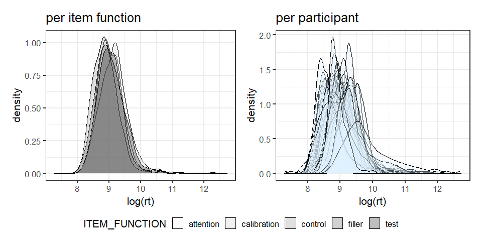
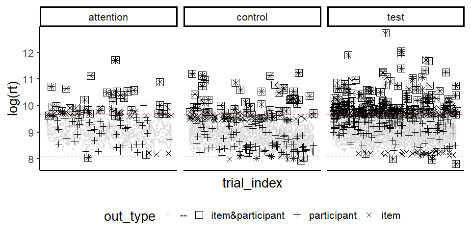
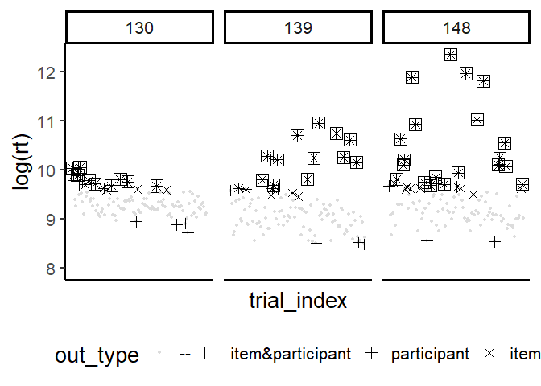
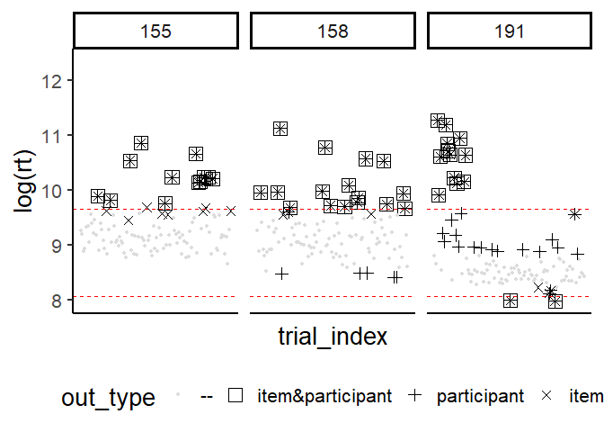
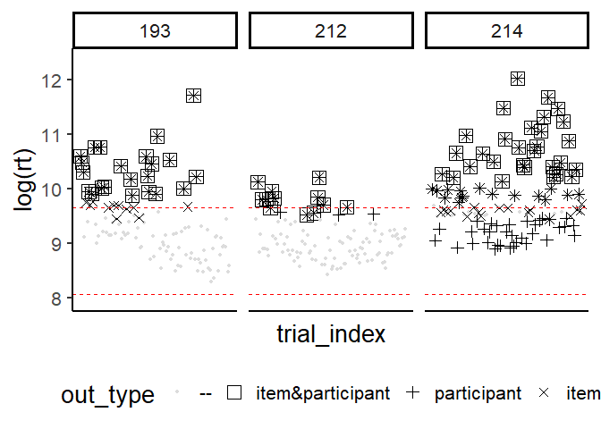

Read in questionnaire:


```r
filler_items = read.csv("./judgments/all/LikertSkala_filler.csv", fileEncoding = "UTF-8")
test_items = read.csv("./judgments/all/LikertSkala_test.csv", fileEncoding = "UTF-8") %>% 
  mutate(ITEM_FUNCTION = "test")
questionnaire = bind_rows(filler_items, test_items) %>%
  mutate_at(.vars = c("CONDITION_NO","KEY_CONDITION", "workerId"), .funs = as_factor)
```


# Progress (incomplete submissions) 

We require that at least 90\% of the questionnaire has been completed. 
(Note: we assume that there are no missing trials due to data loss / technical errors).


```r
available_trials = questionnaire %>%
  group_by(workerId) %>%
  summarise(trials = n(), 
            trials_prop = n()/length(unique(questionnaire$trial_index))) %>%
  mutate(accept = ifelse(trials_prop < 0.9, FALSE, TRUE)) %>%
  arrange(trials_prop)
```

Let's check whether there are participants that left the questionnaire prematurely:


```r
available_trials %>% filter(trials_prop < 1) %>% kable() 
```

<table class="table table-striped" style="width: auto !important; margin-left: auto; margin-right: auto;">
 <thead>
  <tr>
   <th style="text-align:left;"> workerId </th>
   <th style="text-align:right;"> trials </th>
   <th style="text-align:right;"> trials_prop </th>
   <th style="text-align:left;"> accept </th>
  </tr>
 </thead>
<tbody>
  <tr>
   <td style="text-align:left;"> 207 </td>
   <td style="text-align:right;"> 3 </td>
   <td style="text-align:right;"> 0.028 </td>
   <td style="text-align:left;"> FALSE </td>
  </tr>
  <tr>
   <td style="text-align:left;"> 204 </td>
   <td style="text-align:right;"> 65 </td>
   <td style="text-align:right;"> 0.602 </td>
   <td style="text-align:left;"> FALSE </td>
  </tr>
</tbody>
</table>


Remove incomplete data from questionnaire:


```r
 questionnaire = questionnaire %>%
   filter(!(workerId %in% (
     available_trials %>% filter(accept == FALSE) %>% pull(workerId)
   )))
```


# Latency-based identification 


## Spammers

We will reject workers with *mean*(RT) < 3000 ms (as simple spammers) and those  with *median*(RT) < 3000 ms (as clever spammers):


```r
simple_spammer = questionnaire %>%
                         group_by(workerId) %>%
                         summarise(score = mean(rt)) %>%
                         mutate(criterion = "meanRT", 
                                accept = ifelse(score < 3000, FALSE, TRUE))
```

Are there any simple spammers?

```r
simple_spammer %>% filter(accept == FALSE) %>% kable() 
```

<table class="table table-striped" style="width: auto !important; margin-left: auto; margin-right: auto;">
 <thead>
  <tr>
   <th style="text-align:left;"> workerId </th>
   <th style="text-align:right;"> score </th>
   <th style="text-align:left;"> criterion </th>
   <th style="text-align:left;"> accept </th>
  </tr>
 </thead>
<tbody>
  <tr>

  </tr>
</tbody>
</table>


```r
clever_spammer = questionnaire %>%
                         group_by(workerId) %>%
                         summarise(score = median(rt)) %>%
                         mutate(criterion = "medianRT", 
                                accept = ifelse(score < 3000, FALSE, TRUE))
```

Are there any clever spammers?

```r
clever_spammer %>% filter(accept == FALSE) %>% kable() 
```

<table class="table table-striped" style="width: auto !important; margin-left: auto; margin-right: auto;">
 <thead>
  <tr>
   <th style="text-align:left;"> workerId </th>
   <th style="text-align:right;"> score </th>
   <th style="text-align:left;"> criterion </th>
   <th style="text-align:left;"> accept </th>
  </tr>
 </thead>
<tbody>
  <tr>

  </tr>
</tbody>
</table>


## RT distributions

Participants and different (groups of) items presumably exhibit different RT distributions:


```r
rt_density_worker = questionnaire %>%
  ggplot(aes(x=log(rt), group = workerId)) + 
  geom_density(alpha=.3, fill = "#DFF1FF")

rt_density_item_funs = questionnaire %>% 
  ggplot(aes(x = log(rt), fill=ITEM_FUNCTION)) +
  geom_density(alpha=.3) + 
  scale_fill_brewer(palette = "Greys")
```
  


The more diverse the distribution the stronger is the superiority of ReMFOD (see next chapter) above generic cutoff points for outlier detection. 

## Underperforming 

**Recursive multi-factorial outlier detection (ReMFOD , @Pieper_et_al_2022)**

```r
source("./R Sources/ReMFOD.R")
```

ReMFOD (see [source code](./R Sources/ReMFOD.R)) aims at identifying individual trials as genuine intermissions  and rushes. In doing so, ReMFOD accounts for different RT distributions of different participants and item functions, as well as swamping and masking effects. Underpinned by these suspicious individual trials, underperforming participants can be determined by means of proportion of trials not responded to wholeheartedly. We propose to discard participants who have responded genuinely to less than 90~\% of trials because they supposedly did not meet the task with the necessary seriousness.

To account for different RT distributions, ReMFOD compares the RT of each trial to a lower and an upper cutoff point, which each consider two  cutoff criteria, respectively: The first criterion  is computed with respect to the group of trials with the same *item function* (i.e. attention trials only, control trials only, etc.) regardless of the participant responding, the second one is computed with respect to  all trials of the corresponding participant (regardless of the item function). Only if an RT surmounts or  falls below *both*  criteria, it will be designated as a *genuine intermission*
or as a *genuine rush*.[^1]

[^1]: @Miller_1991 proposes the values of 3 (very conservative), 2.5 (moderately conservative) or even 2 (poorly
conservative).  @Haeussler_Juzek_2016 suggest using an asymmetric criterion (using standard deviations) of -1.5 for the lower and +4 for the upper cutoff point.

\begin{align}    \label{eq:cutoff_outlier_rt}
    \textit{cutoff_}&\textit{intermission} = \max \left\{  \right.\\
&\left. \text{median}(\textit{RTs:participant}) + 2.5 \times \text{mad}(\textit{RTs:participant}), \right.\nonumber\\
 &\left. \text{median}(\textit{RTs:item_function}) + 2.5 \times \text{mad}(\textit{RTs:item_function})\right.\nonumber\}
\end{align}

\begin{align}  \label{eq:cutoff_guesses_rt}
    \textit{cutoff_}&\textit{rush} = \min \left\{  \right.\\
&\left. \text{median}(\textit{RTs:participant}) - 1.5 \times \text{mad}(\textit{RTs:participant}), \right.\nonumber\\
 &\left. \text{median}(\textit{RTs:item_function}) - 1.5 \times \text{mad}(\textit{RTs:item_function})\right.\nonumber\}
\end{align}

To account for swamping and masking effects (see @Ben-Gal_2005), 
the process described above will be repeated on a reduced data set (i.e. excluding already detected outliers) until no more outliers  can be found. Therefore, in each iteration step, the cutoff points must be computed afresh. 


### Overview plot for item functions

Different outlier types, computed with respect to different groups, are marked by different shapes: Box-shaped trials are the only RTs we consider as genuine intermissions or rushes. Note that the shapes may overlap as these outliers have been computed by various procedures differing in the groups they included to identify outliers.


```r
## compute different outlier types based on the whole questionnaire and plot these
remfod_plot = questionnaire  %>% outlier_plots_remfod()
item_plot = remfod_plot # we are going to reuse remfod_plot for workers
## remove data we are currently not interested in from the plot 
item_plot$data = item_plot$data %>% 
  filter(!ITEM_FUNCTION %in% c("calibration", "filler"))
## structure plot as you like
item_plot + facet_wrap(~ ITEM_FUNCTION, nrow = 1)
```

<!-- -->


### Performance of participants

We expect that 90 % of the trials are answered without genuine intermission or rushes, i.e. that 90 % of the RTs are *valid*


```r
rt_outlier_count = remfod(questionnaire)  %>% 
  group_by(workerId,  direction) %>% tally() %>%
  spread(key = "direction", value = "n") %>% 
  rename( none = "<NA>") %>%  
  mutate_if(is.numeric, replace_na, 0) %>%
  mutate(trials_total = sum(long, short, none),
         prop_long = long/trials_total, 
         prop_short = short/trials_total,
         prop_out = (short+long)/trials_total,
         prop_valid = none/trials_total,
         accept = ifelse(prop_valid < 0.9, FALSE, TRUE)) %>%
  arrange(prop_valid) %>%
  mutate_if(is.numeric, round, 4)
```


```{=html}
<div id="htmlwidget-5cc9ead872b026ce7dd3" style="width:100%;height:auto;" class="datatables html-widget"></div>
<script type="application/json" data-for="htmlwidget-5cc9ead872b026ce7dd3">{"x":{"filter":"none","vertical":false,"extensions":["Buttons"],"data":[["214","193","148","158","191","139","155","212","130","183","157","172","202","209","213","182","184","197","200","133","137","177","180","181","189","203","210","138","150","170","176","185","187","192","128","149","162","163","211","166","174","194","201","208","134","135","136","151","159","165","168","171","175","178","190","196","206","215","131","147","156","161","167","169","179","186","199","205","132","160"],[29,22,20,16,12,13,12,12,11,9,8,8,7,8,8,7,7,7,7,6,6,6,6,5,6,6,6,5,5,0,5,5,5,5,4,4,4,2,4,1,3,3,2,3,2,2,2,2,1,2,2,2,2,2,2,2,2,2,1,1,1,1,1,1,1,0,1,1,0,0],[0,0,0,0,2,0,0,0,0,0,0,0,1,0,0,0,0,0,0,0,0,0,0,1,0,0,0,0,0,5,0,0,0,0,0,0,0,2,0,2,0,0,1,0,0,0,0,0,1,0,0,0,0,0,0,0,0,0,0,0,0,0,0,0,0,1,0,0,0,0],[79,86,88,92,94,95,96,96,97,99,100,100,100,100,100,101,101,101,101,102,102,102,102,102,102,102,102,103,103,103,103,103,103,103,104,104,104,104,104,105,105,105,105,105,106,106,106,106,106,106,106,106,106,106,106,106,106,106,107,107,107,107,107,107,107,107,107,107,108,108],[108,108,108,108,108,108,108,108,108,108,108,108,108,108,108,108,108,108,108,108,108,108,108,108,108,108,108,108,108,108,108,108,108,108,108,108,108,108,108,108,108,108,108,108,108,108,108,108,108,108,108,108,108,108,108,108,108,108,108,108,108,108,108,108,108,108,108,108,108,108],[0.2685,0.2037,0.1852,0.1481,0.1111,0.1204,0.1111,0.1111,0.1019,0.0833,0.0741,0.0741,0.0648,0.0741,0.0741,0.0648,0.0648,0.0648,0.0648,0.0556,0.0556,0.0556,0.0556,0.0463,0.0556,0.0556,0.0556,0.0463,0.0463,0,0.0463,0.0463,0.0463,0.0463,0.037,0.037,0.037,0.0185,0.037,0.0093,0.0278,0.0278,0.0185,0.0278,0.0185,0.0185,0.0185,0.0185,0.0093,0.0185,0.0185,0.0185,0.0185,0.0185,0.0185,0.0185,0.0185,0.0185,0.0093,0.0093,0.0093,0.0093,0.0093,0.0093,0.0093,0,0.0093,0.0093,0,0],[0,0,0,0,0.0185,0,0,0,0,0,0,0,0.0093,0,0,0,0,0,0,0,0,0,0,0.0093,0,0,0,0,0,0.0463,0,0,0,0,0,0,0,0.0185,0,0.0185,0,0,0.0093,0,0,0,0,0,0.0093,0,0,0,0,0,0,0,0,0,0,0,0,0,0,0,0,0.0093,0,0,0,0],[0.2685,0.2037,0.1852,0.1481,0.1296,0.1204,0.1111,0.1111,0.1019,0.0833,0.0741,0.0741,0.0741,0.0741,0.0741,0.0648,0.0648,0.0648,0.0648,0.0556,0.0556,0.0556,0.0556,0.0556,0.0556,0.0556,0.0556,0.0463,0.0463,0.0463,0.0463,0.0463,0.0463,0.0463,0.037,0.037,0.037,0.037,0.037,0.0278,0.0278,0.0278,0.0278,0.0278,0.0185,0.0185,0.0185,0.0185,0.0185,0.0185,0.0185,0.0185,0.0185,0.0185,0.0185,0.0185,0.0185,0.0185,0.0093,0.0093,0.0093,0.0093,0.0093,0.0093,0.0093,0.0093,0.0093,0.0093,0,0],[0.7315,0.7963,0.8148,0.8519,0.8704,0.8796,0.8889,0.8889,0.8981,0.9167,0.9259,0.9259,0.9259,0.9259,0.9259,0.9352,0.9352,0.9352,0.9352,0.9444,0.9444,0.9444,0.9444,0.9444,0.9444,0.9444,0.9444,0.9537,0.9537,0.9537,0.9537,0.9537,0.9537,0.9537,0.963,0.963,0.963,0.963,0.963,0.9722,0.9722,0.9722,0.9722,0.9722,0.9815,0.9815,0.9815,0.9815,0.9815,0.9815,0.9815,0.9815,0.9815,0.9815,0.9815,0.9815,0.9815,0.9815,0.9907,0.9907,0.9907,0.9907,0.9907,0.9907,0.9907,0.9907,0.9907,0.9907,1,1],[false,false,false,false,false,false,false,false,false,true,true,true,true,true,true,true,true,true,true,true,true,true,true,true,true,true,true,true,true,true,true,true,true,true,true,true,true,true,true,true,true,true,true,true,true,true,true,true,true,true,true,true,true,true,true,true,true,true,true,true,true,true,true,true,true,true,true,true,true,true]],"container":"<table class=\"display\">\n  <thead>\n    <tr>\n      <th>workerId<\/th>\n      <th>long<\/th>\n      <th>short<\/th>\n      <th>none<\/th>\n      <th>trials_total<\/th>\n      <th>prop_long<\/th>\n      <th>prop_short<\/th>\n      <th>prop_out<\/th>\n      <th>prop_valid<\/th>\n      <th>accept<\/th>\n    <\/tr>\n  <\/thead>\n<\/table>","options":{"dom":"Blfrtip","pageLength":5,"searching":false,"buttons":["csv","excel","pdf"],"columnDefs":[{"className":"dt-right","targets":[1,2,3,4,5,6,7,8]}],"order":[],"autoWidth":false,"orderClasses":false,"lengthMenu":[5,10,25,50,100]}},"evals":[],"jsHooks":[]}</script>
```


#### Plots of individual participants

Some underperforming participants

<!-- --><!-- --><!-- -->


***
Further exemplative workers

<!-- -->


# Item-based identification 


```r
control_trials = questionnaire %>% 
  filter(ITEM_FUNCTION == "control")  %>%
  droplevels()

attention_trials = questionnaire %>% 
  filter(ITEM_FUNCTION == "attention")  %>%
  droplevels()
```

Each control group should provide chances of less than 5% to pass controls by guessing. 

## Guessing probabilities  

```r
source("./R Sources/GuessingProbs.R")
```

To compute the probability (by standard binomial expansions) of (*exactly!*) k correct answers out of N trials, where 

- ***k*** amount of trials answered correctly
- ***N*** mount of total trials
- ***p*** the probability of a correct response
- ***q*** the probability of an incorrect response

we can use the formula  (see @Frederick_Speed_2007), implemented by the  function `k_out_of_N`:

\begin{align} 
 \label{eq:probs_binomial}
 \frac{N!}{k!(N - k)!}&p^{k}q^{N-k}\text{, where}   \\
p &= \text{ probability of a correct response}  \nonumber  \\
q &= \text{ probability of an incorrect response} \nonumber 
\end{align}

To compute the probability (by standard binomial expansions) of k *or fewer* correct answers out of N trials, we can use the function `k_out_of_N_cumulative`, which returns the sum of all the probabilities from 0 to k  (see [source code](./R Sources/GuessingProbs.R)).


## Criterion selection

Attention trials only exist in ungrammatical conditions, the analysis hence amounts to counting acceptable response.


Let's look at the chances to answer **at least** k out of N items correct if three of the options are considered correct, and two incorrect in a 5-pt-LS are considered correct:


```r
k_out_of_N_matrix_cumulative(p = 3/5, Ns = seq(4,16,2), ks = c(2:12))
```


<table class="table table-striped" style="width: auto !important; margin-left: auto; margin-right: auto;">
<caption>Table 3a in @Pieper_et_al_2022</caption>
 <thead>
  <tr>
   <th style="text-align:right;"> N\k </th>
   <th style="text-align:right;"> 2 </th>
   <th style="text-align:right;"> 3 </th>
   <th style="text-align:right;"> 4 </th>
   <th style="text-align:right;"> 5 </th>
   <th style="text-align:right;"> 6 </th>
   <th style="text-align:right;"> 7 </th>
   <th style="text-align:right;"> 8 </th>
   <th style="text-align:right;"> 9 </th>
   <th style="text-align:right;"> 10 </th>
   <th style="text-align:right;"> 11 </th>
   <th style="text-align:right;"> 12 </th>
  </tr>
 </thead>
<tbody>
  <tr>
   <td style="text-align:right;font-weight: bold;"> 4 </td>
   <td style="text-align:right;"> 0.821 </td>
   <td style="text-align:right;"> 0.475 </td>
   <td style="text-align:right;"> 0.130 </td>
   <td style="text-align:right;">  </td>
   <td style="text-align:right;">  </td>
   <td style="text-align:right;">  </td>
   <td style="text-align:right;">  </td>
   <td style="text-align:right;">  </td>
   <td style="text-align:right;">  </td>
   <td style="text-align:right;">  </td>
   <td style="text-align:right;">  </td>
  </tr>
  <tr>
   <td style="text-align:right;font-weight: bold;"> 6 </td>
   <td style="text-align:right;"> 0.959 </td>
   <td style="text-align:right;"> 0.821 </td>
   <td style="text-align:right;"> 0.544 </td>
   <td style="text-align:right;"> 0.233 </td>
   <td style="text-align:right;"> 0.047 </td>
   <td style="text-align:right;">  </td>
   <td style="text-align:right;">  </td>
   <td style="text-align:right;">  </td>
   <td style="text-align:right;">  </td>
   <td style="text-align:right;">  </td>
   <td style="text-align:right;">  </td>
  </tr>
  <tr>
   <td style="text-align:right;font-weight: bold;"> 8 </td>
   <td style="text-align:right;"> 0.991 </td>
   <td style="text-align:right;"> 0.950 </td>
   <td style="text-align:right;"> 0.826 </td>
   <td style="text-align:right;"> 0.594 </td>
   <td style="text-align:right;"> 0.315 </td>
   <td style="text-align:right;"> 0.106 </td>
   <td style="text-align:right;"> 0.017 </td>
   <td style="text-align:right;">  </td>
   <td style="text-align:right;">  </td>
   <td style="text-align:right;">  </td>
   <td style="text-align:right;">  </td>
  </tr>
  <tr>
   <td style="text-align:right;font-weight: bold;"> 10 </td>
   <td style="text-align:right;"> 0.998 </td>
   <td style="text-align:right;"> 0.988 </td>
   <td style="text-align:right;"> 0.945 </td>
   <td style="text-align:right;"> 0.834 </td>
   <td style="text-align:right;"> 0.633 </td>
   <td style="text-align:right;"> 0.382 </td>
   <td style="text-align:right;"> 0.167 </td>
   <td style="text-align:right;"> 0.046 </td>
   <td style="text-align:right;"> 0.006 </td>
   <td style="text-align:right;">  </td>
   <td style="text-align:right;">  </td>
  </tr>
  <tr>
   <td style="text-align:right;font-weight: bold;"> 12 </td>
   <td style="text-align:right;"> 1.000 </td>
   <td style="text-align:right;"> 0.997 </td>
   <td style="text-align:right;"> 0.985 </td>
   <td style="text-align:right;"> 0.943 </td>
   <td style="text-align:right;"> 0.842 </td>
   <td style="text-align:right;"> 0.665 </td>
   <td style="text-align:right;"> 0.438 </td>
   <td style="text-align:right;"> 0.225 </td>
   <td style="text-align:right;"> 0.083 </td>
   <td style="text-align:right;"> 0.020 </td>
   <td style="text-align:right;"> 0.002 </td>
  </tr>
  <tr>
   <td style="text-align:right;font-weight: bold;"> 14 </td>
   <td style="text-align:right;"> 1.000 </td>
   <td style="text-align:right;"> 0.999 </td>
   <td style="text-align:right;"> 0.996 </td>
   <td style="text-align:right;"> 0.982 </td>
   <td style="text-align:right;"> 0.942 </td>
   <td style="text-align:right;"> 0.850 </td>
   <td style="text-align:right;"> 0.692 </td>
   <td style="text-align:right;"> 0.486 </td>
   <td style="text-align:right;"> 0.279 </td>
   <td style="text-align:right;"> 0.124 </td>
   <td style="text-align:right;"> 0.040 </td>
  </tr>
  <tr>
   <td style="text-align:right;font-weight: bold;"> 16 </td>
   <td style="text-align:right;"> 1.000 </td>
   <td style="text-align:right;"> 1.000 </td>
   <td style="text-align:right;"> 0.999 </td>
   <td style="text-align:right;"> 0.995 </td>
   <td style="text-align:right;"> 0.981 </td>
   <td style="text-align:right;"> 0.942 </td>
   <td style="text-align:right;"> 0.858 </td>
   <td style="text-align:right;"> 0.716 </td>
   <td style="text-align:right;"> 0.527 </td>
   <td style="text-align:right;"> 0.329 </td>
   <td style="text-align:right;"> 0.167 </td>
  </tr>
</tbody>
</table>

If we assume a probability of less than 5~\% to pass a test by chance and combine it with the qualification that not all trials need to be answered correctly, it follows that nine out of ten trials need to be responded to correctly. 

If we take the neutral point not to be acceptable, this number is reduced to five correct responses out of six trials:


```r
k_out_of_N_matrix_cumulative(p = 2/5, Ns = seq(4,16,2), ks = c(2:12))
```


<table class="table table-striped" style="width: auto !important; margin-left: auto; margin-right: auto;">
<caption>Table 3b in @Pieper_et_al_2022</caption>
 <thead>
  <tr>
   <th style="text-align:right;"> N\k </th>
   <th style="text-align:right;"> 2 </th>
   <th style="text-align:right;"> 3 </th>
   <th style="text-align:right;"> 4 </th>
   <th style="text-align:right;"> 5 </th>
   <th style="text-align:right;"> 6 </th>
   <th style="text-align:right;"> 7 </th>
   <th style="text-align:right;"> 8 </th>
   <th style="text-align:right;"> 9 </th>
   <th style="text-align:right;"> 10 </th>
   <th style="text-align:right;"> 11 </th>
   <th style="text-align:right;"> 12 </th>
  </tr>
 </thead>
<tbody>
  <tr>
   <td style="text-align:right;font-weight: bold;"> 4 </td>
   <td style="text-align:right;"> 0.525 </td>
   <td style="text-align:right;"> 0.179 </td>
   <td style="text-align:right;"> 0.026 </td>
   <td style="text-align:right;">  </td>
   <td style="text-align:right;">  </td>
   <td style="text-align:right;">  </td>
   <td style="text-align:right;">  </td>
   <td style="text-align:right;">  </td>
   <td style="text-align:right;">  </td>
   <td style="text-align:right;">  </td>
   <td style="text-align:right;">  </td>
  </tr>
  <tr>
   <td style="text-align:right;font-weight: bold;"> 6 </td>
   <td style="text-align:right;"> 0.767 </td>
   <td style="text-align:right;"> 0.456 </td>
   <td style="text-align:right;"> 0.179 </td>
   <td style="text-align:right;"> 0.041 </td>
   <td style="text-align:right;"> 0.004 </td>
   <td style="text-align:right;">  </td>
   <td style="text-align:right;">  </td>
   <td style="text-align:right;">  </td>
   <td style="text-align:right;">  </td>
   <td style="text-align:right;">  </td>
   <td style="text-align:right;">  </td>
  </tr>
  <tr>
   <td style="text-align:right;font-weight: bold;"> 8 </td>
   <td style="text-align:right;"> 0.894 </td>
   <td style="text-align:right;"> 0.685 </td>
   <td style="text-align:right;"> 0.406 </td>
   <td style="text-align:right;"> 0.174 </td>
   <td style="text-align:right;"> 0.050 </td>
   <td style="text-align:right;"> 0.009 </td>
   <td style="text-align:right;"> 0.001 </td>
   <td style="text-align:right;">  </td>
   <td style="text-align:right;">  </td>
   <td style="text-align:right;">  </td>
   <td style="text-align:right;">  </td>
  </tr>
  <tr>
   <td style="text-align:right;font-weight: bold;"> 10 </td>
   <td style="text-align:right;"> 0.954 </td>
   <td style="text-align:right;"> 0.833 </td>
   <td style="text-align:right;"> 0.618 </td>
   <td style="text-align:right;"> 0.367 </td>
   <td style="text-align:right;"> 0.166 </td>
   <td style="text-align:right;"> 0.055 </td>
   <td style="text-align:right;"> 0.012 </td>
   <td style="text-align:right;"> 0.002 </td>
   <td style="text-align:right;"> 0.000 </td>
   <td style="text-align:right;">  </td>
   <td style="text-align:right;">  </td>
  </tr>
  <tr>
   <td style="text-align:right;font-weight: bold;"> 12 </td>
   <td style="text-align:right;"> 0.980 </td>
   <td style="text-align:right;"> 0.917 </td>
   <td style="text-align:right;"> 0.775 </td>
   <td style="text-align:right;"> 0.562 </td>
   <td style="text-align:right;"> 0.335 </td>
   <td style="text-align:right;"> 0.158 </td>
   <td style="text-align:right;"> 0.057 </td>
   <td style="text-align:right;"> 0.015 </td>
   <td style="text-align:right;"> 0.003 </td>
   <td style="text-align:right;"> 0.000 </td>
   <td style="text-align:right;"> 0.000 </td>
  </tr>
  <tr>
   <td style="text-align:right;font-weight: bold;"> 14 </td>
   <td style="text-align:right;"> 0.992 </td>
   <td style="text-align:right;"> 0.960 </td>
   <td style="text-align:right;"> 0.876 </td>
   <td style="text-align:right;"> 0.721 </td>
   <td style="text-align:right;"> 0.514 </td>
   <td style="text-align:right;"> 0.308 </td>
   <td style="text-align:right;"> 0.150 </td>
   <td style="text-align:right;"> 0.058 </td>
   <td style="text-align:right;"> 0.018 </td>
   <td style="text-align:right;"> 0.004 </td>
   <td style="text-align:right;"> 0.001 </td>
  </tr>
  <tr>
   <td style="text-align:right;font-weight: bold;"> 16 </td>
   <td style="text-align:right;"> 0.997 </td>
   <td style="text-align:right;"> 0.982 </td>
   <td style="text-align:right;"> 0.935 </td>
   <td style="text-align:right;"> 0.833 </td>
   <td style="text-align:right;"> 0.671 </td>
   <td style="text-align:right;"> 0.473 </td>
   <td style="text-align:right;"> 0.284 </td>
   <td style="text-align:right;"> 0.142 </td>
   <td style="text-align:right;"> 0.058 </td>
   <td style="text-align:right;"> 0.019 </td>
   <td style="text-align:right;"> 0.005 </td>
  </tr>
</tbody>
</table>


As we stick to the positional account  for control trials (see @Pieper_et_al_2022), we need to evaluate 
grammatical and ungrammatical trials separately. 

On a positional account, the assessment of participants' performance is carried out separately for grammatical (`CONDTION_NO == 1`) and ungrammatical (`CONDTION_NO == 2`) stimuli,  focusing on the pertinent  side of the scale in each case. We recommend allowing the neutral point as legitimate response to grammatical stimuli but not to ungrammatical stimuli as it does neither reliably indicate the rejection of the grammatical version nor the rejection of the ungrammatical version. The chance to pass control trials is then the joint probability of passing the two groups individually. Regarding our rule of thumb, these shall not exceed 5\%.

Let's have a look at some joint probabilities for *up to eight* trials per group, where group sizes are equal. 


```r
probs_joint = do.call(rbind, lapply(1:8,function(i){
  probs_joint_positional(i, 3/5, # N, p grammatical
                         i, 2/5) #N, p ungrammatical
}))
```

To receive more balanced options, we further set the constraints that passing grammatical and ungrammatical trials needs to be below 0.6 and that $k$ needs to be less than $N$ in both conditions.


```r
probs_joint %>%
  filter(joint_probs <= 0.05 & gram_probs < 0.6 & ungram_probs < 0.6) %>%
  filter(gram_k < gram_N & ungram_k < ungram_N) %>%
  mutate_if(is.numeric, round, digits = 4) %>%
  unite(N, gram_N, ungram_N, sep = "-") %>% relocate(N) %>%
  arrange(N, ungram_k) %>%
  kable(caption = "Table 4 in @Pieper_et_al_2022")
```

<table class="table table-striped" style="width: auto !important; margin-left: auto; margin-right: auto;">
<caption>Table 4 in @Pieper_et_al_2022</caption>
 <thead>
  <tr>
   <th style="text-align:left;"> N </th>
   <th style="text-align:right;"> gram_k </th>
   <th style="text-align:right;"> gram_probs </th>
   <th style="text-align:right;"> ungram_k </th>
   <th style="text-align:right;"> ungram_probs </th>
   <th style="text-align:right;"> joint_probs </th>
  </tr>
 </thead>
<tbody>
  <tr>
   <td style="text-align:left;"> 5-5 </td>
   <td style="text-align:right;"> 4 </td>
   <td style="text-align:right;"> 0.337 </td>
   <td style="text-align:right;"> 4 </td>
   <td style="text-align:right;"> 0.087 </td>
   <td style="text-align:right;"> 0.029 </td>
  </tr>
  <tr>
   <td style="text-align:left;"> 6-6 </td>
   <td style="text-align:right;"> 5 </td>
   <td style="text-align:right;"> 0.233 </td>
   <td style="text-align:right;"> 4 </td>
   <td style="text-align:right;"> 0.179 </td>
   <td style="text-align:right;"> 0.042 </td>
  </tr>
  <tr>
   <td style="text-align:left;"> 6-6 </td>
   <td style="text-align:right;"> 4 </td>
   <td style="text-align:right;"> 0.544 </td>
   <td style="text-align:right;"> 5 </td>
   <td style="text-align:right;"> 0.041 </td>
   <td style="text-align:right;"> 0.022 </td>
  </tr>
  <tr>
   <td style="text-align:left;"> 6-6 </td>
   <td style="text-align:right;"> 5 </td>
   <td style="text-align:right;"> 0.233 </td>
   <td style="text-align:right;"> 5 </td>
   <td style="text-align:right;"> 0.041 </td>
   <td style="text-align:right;"> 0.010 </td>
  </tr>
  <tr>
   <td style="text-align:left;"> 7-7 </td>
   <td style="text-align:right;"> 6 </td>
   <td style="text-align:right;"> 0.159 </td>
   <td style="text-align:right;"> 4 </td>
   <td style="text-align:right;"> 0.290 </td>
   <td style="text-align:right;"> 0.046 </td>
  </tr>
  <tr>
   <td style="text-align:left;"> 7-7 </td>
   <td style="text-align:right;"> 5 </td>
   <td style="text-align:right;"> 0.420 </td>
   <td style="text-align:right;"> 5 </td>
   <td style="text-align:right;"> 0.096 </td>
   <td style="text-align:right;"> 0.040 </td>
  </tr>
  <tr>
   <td style="text-align:left;"> 7-7 </td>
   <td style="text-align:right;"> 6 </td>
   <td style="text-align:right;"> 0.159 </td>
   <td style="text-align:right;"> 5 </td>
   <td style="text-align:right;"> 0.096 </td>
   <td style="text-align:right;"> 0.015 </td>
  </tr>
  <tr>
   <td style="text-align:left;"> 7-7 </td>
   <td style="text-align:right;"> 5 </td>
   <td style="text-align:right;"> 0.420 </td>
   <td style="text-align:right;"> 6 </td>
   <td style="text-align:right;"> 0.019 </td>
   <td style="text-align:right;"> 0.008 </td>
  </tr>
  <tr>
   <td style="text-align:left;"> 7-7 </td>
   <td style="text-align:right;"> 6 </td>
   <td style="text-align:right;"> 0.159 </td>
   <td style="text-align:right;"> 6 </td>
   <td style="text-align:right;"> 0.019 </td>
   <td style="text-align:right;"> 0.003 </td>
  </tr>
  <tr>
   <td style="text-align:left;"> 8-8 </td>
   <td style="text-align:right;"> 7 </td>
   <td style="text-align:right;"> 0.106 </td>
   <td style="text-align:right;"> 4 </td>
   <td style="text-align:right;"> 0.406 </td>
   <td style="text-align:right;"> 0.043 </td>
  </tr>
  <tr>
   <td style="text-align:left;"> 8-8 </td>
   <td style="text-align:right;"> 7 </td>
   <td style="text-align:right;"> 0.106 </td>
   <td style="text-align:right;"> 5 </td>
   <td style="text-align:right;"> 0.174 </td>
   <td style="text-align:right;"> 0.018 </td>
  </tr>
  <tr>
   <td style="text-align:left;"> 8-8 </td>
   <td style="text-align:right;"> 5 </td>
   <td style="text-align:right;"> 0.594 </td>
   <td style="text-align:right;"> 6 </td>
   <td style="text-align:right;"> 0.050 </td>
   <td style="text-align:right;"> 0.030 </td>
  </tr>
  <tr>
   <td style="text-align:left;"> 8-8 </td>
   <td style="text-align:right;"> 6 </td>
   <td style="text-align:right;"> 0.315 </td>
   <td style="text-align:right;"> 6 </td>
   <td style="text-align:right;"> 0.050 </td>
   <td style="text-align:right;"> 0.016 </td>
  </tr>
  <tr>
   <td style="text-align:left;"> 8-8 </td>
   <td style="text-align:right;"> 7 </td>
   <td style="text-align:right;"> 0.106 </td>
   <td style="text-align:right;"> 6 </td>
   <td style="text-align:right;"> 0.050 </td>
   <td style="text-align:right;"> 0.005 </td>
  </tr>
  <tr>
   <td style="text-align:left;"> 8-8 </td>
   <td style="text-align:right;"> 5 </td>
   <td style="text-align:right;"> 0.594 </td>
   <td style="text-align:right;"> 7 </td>
   <td style="text-align:right;"> 0.009 </td>
   <td style="text-align:right;"> 0.005 </td>
  </tr>
  <tr>
   <td style="text-align:left;"> 8-8 </td>
   <td style="text-align:right;"> 6 </td>
   <td style="text-align:right;"> 0.315 </td>
   <td style="text-align:right;"> 7 </td>
   <td style="text-align:right;"> 0.009 </td>
   <td style="text-align:right;"> 0.003 </td>
  </tr>
  <tr>
   <td style="text-align:left;"> 8-8 </td>
   <td style="text-align:right;"> 7 </td>
   <td style="text-align:right;"> 0.106 </td>
   <td style="text-align:right;"> 7 </td>
   <td style="text-align:right;"> 0.009 </td>
   <td style="text-align:right;"> 0.001 </td>
  </tr>
</tbody>
</table>


### Evaluation groups

There are different ways to proceed: we could evaluate attention and control items as one group, evaluate them separately, and even evaluate related and unrelated control items separately. 
The best choice may depend on the exact nature of your trials.
We are going to compute evaluations based on all groups mentioned.

To facilitate computation, we combine the different groups (named by `ITEM_FUNCTION`) into a single frame -- whereby adapting `ITEM_FUNCTION` in some cases: 


```r
eval_trials = rbind(control_trials, attention_trials) %>% 
  # attenion or control items evaluated as one group
  mutate(ITEM_FUNCTION = "attention|control") %>% 
  bind_rows(attention_trials) %>%
  bind_rows(control_trials) %>% 
  # separate evaluation of related and unrelated control trials
  bind_rows(control_trials %>% 
                     mutate(ITEM_FUNCTION = paste(ITEM_FUNCTION, ITEM_SUBGROUP, sep="_"))
                   ) 
```

Find number of trials in each group (per questionnaire):

```r
Ns =   eval_trials %>% 
  select(ITEM_FUNCTION, CONDITION_NO, itemId) %>%
  distinct() %>% 
  group_by(ITEM_FUNCTION, CONDITION_NO) %>% 
  tally() %>%
  spread(key = CONDITION_NO, value = n, sep = "_") %>%
  mutate_if(is.numeric, replace_na, 0)
```

<table class="table table-striped" style="width: auto !important; margin-left: auto; margin-right: auto;">
 <thead>
  <tr>
   <th style="text-align:left;"> ITEM_FUNCTION </th>
   <th style="text-align:right;"> CONDITION_NO_1 </th>
   <th style="text-align:right;"> CONDITION_NO_2 </th>
  </tr>
 </thead>
<tbody>
  <tr>
   <td style="text-align:left;"> attention </td>
   <td style="text-align:right;"> 0 </td>
   <td style="text-align:right;"> 12 </td>
  </tr>
  <tr>
   <td style="text-align:left;"> attention|control </td>
   <td style="text-align:right;"> 12 </td>
   <td style="text-align:right;"> 24 </td>
  </tr>
  <tr>
   <td style="text-align:left;"> control </td>
   <td style="text-align:right;"> 12 </td>
   <td style="text-align:right;"> 12 </td>
  </tr>
  <tr>
   <td style="text-align:left;"> control_related </td>
   <td style="text-align:right;"> 6 </td>
   <td style="text-align:right;"> 6 </td>
  </tr>
  <tr>
   <td style="text-align:left;"> control_unrelated </td>
   <td style="text-align:right;"> 6 </td>
   <td style="text-align:right;"> 6 </td>
  </tr>
</tbody>
</table>

compute joint probabilities (of passing grammatical and ungrammatical trials):


```r
probs_joint = mapply(probs_joint_positional,
       Ns$CONDITION_NO_1, 3/5, Ns$CONDITION_NO_2, 2/5) %>%
  t() %>% 
  as.data.frame() %>%
  mutate(ITEM_FUNCTION = Ns$ITEM_FUNCTION) %>% 
  relocate(ITEM_FUNCTION) %>%
  unnest(cols = names(.))
```

Note: we may now have inbalanced group sizes. 
Find required k to each group:


```r
eval_criteria = probs_joint %>% 
  filter(joint_probs <= 0.05) %>%
                            ## do not remove attention           
  filter((gram_probs < 0.5||gram_probs == 1) & ungram_probs < 0.5) %>%
                            ## do not remove attention
  filter((gram_k < gram_N || gram_N == 0) & ungram_k < ungram_N) %>% 
  mutate_if(is.numeric, round, digits = 3)  %>%
  group_by(ITEM_FUNCTION) %>%
  slice_max(joint_probs)
```

suggested thresholds (i.e. minimal requirements)

<table class="table table-striped" style="width: auto !important; margin-left: auto; margin-right: auto;">
 <thead>
  <tr>
   <th style="text-align:left;"> ITEM_FUNCTION </th>
   <th style="text-align:right;"> gram_k </th>
   <th style="text-align:right;"> gram_N </th>
   <th style="text-align:right;"> gram_probs </th>
   <th style="text-align:right;"> ungram_k </th>
   <th style="text-align:right;"> ungram_N </th>
   <th style="text-align:right;"> ungram_probs </th>
   <th style="text-align:right;"> joint_probs </th>
  </tr>
 </thead>
<tbody>
  <tr>
   <td style="text-align:left;"> attention </td>
   <td style="text-align:right;"> 0 </td>
   <td style="text-align:right;"> 0 </td>
   <td style="text-align:right;"> 1.000 </td>
   <td style="text-align:right;"> 9 </td>
   <td style="text-align:right;"> 12 </td>
   <td style="text-align:right;"> 0.015 </td>
   <td style="text-align:right;"> 0.015 </td>
  </tr>
  <tr>
   <td style="text-align:left;"> attention|control </td>
   <td style="text-align:right;"> 9 </td>
   <td style="text-align:right;"> 12 </td>
   <td style="text-align:right;"> 0.225 </td>
   <td style="text-align:right;"> 12 </td>
   <td style="text-align:right;"> 24 </td>
   <td style="text-align:right;"> 0.213 </td>
   <td style="text-align:right;"> 0.048 </td>
  </tr>
  <tr>
   <td style="text-align:left;"> control </td>
   <td style="text-align:right;"> 6 </td>
   <td style="text-align:right;"> 12 </td>
   <td style="text-align:right;"> 0.842 </td>
   <td style="text-align:right;"> 8 </td>
   <td style="text-align:right;"> 12 </td>
   <td style="text-align:right;"> 0.057 </td>
   <td style="text-align:right;"> 0.048 </td>
  </tr>
  <tr>
   <td style="text-align:left;"> control_related </td>
   <td style="text-align:right;"> 5 </td>
   <td style="text-align:right;"> 6 </td>
   <td style="text-align:right;"> 0.233 </td>
   <td style="text-align:right;"> 4 </td>
   <td style="text-align:right;"> 6 </td>
   <td style="text-align:right;"> 0.179 </td>
   <td style="text-align:right;"> 0.042 </td>
  </tr>
  <tr>
   <td style="text-align:left;"> control_unrelated </td>
   <td style="text-align:right;"> 5 </td>
   <td style="text-align:right;"> 6 </td>
   <td style="text-align:right;"> 0.233 </td>
   <td style="text-align:right;"> 4 </td>
   <td style="text-align:right;"> 6 </td>
   <td style="text-align:right;"> 0.179 </td>
   <td style="text-align:right;"> 0.042 </td>
  </tr>
</tbody>
</table>
put in long format:


```r
eval_criteria_long = rbind(
  eval_criteria %>% 
    select(ITEM_FUNCTION, starts_with("gram")) %>%
    rename_all(~stringr::str_replace(.,"^gram_","")) %>%
    mutate(CONDITION_NO = 1)
  ,
  eval_criteria %>% 
    select(ITEM_FUNCTION, starts_with("ungram")) %>%
    rename_all(~stringr::str_replace(.,"^ungram_","")) %>%
    mutate(CONDITION_NO = 2)
) %>% 
  rowwise() %>%
  mutate(prop_k = k/N) %>%
  relocate(CONDITION_NO, .after = ITEM_FUNCTION) %>%
  arrange(ITEM_FUNCTION)
```


<table class="table table-striped" style="width: auto !important; margin-left: auto; margin-right: auto;">
 <thead>
  <tr>
   <th style="text-align:left;"> ITEM_FUNCTION </th>
   <th style="text-align:right;"> CONDITION_NO </th>
   <th style="text-align:right;"> k </th>
   <th style="text-align:right;"> N </th>
   <th style="text-align:right;"> probs </th>
   <th style="text-align:right;"> prop_k </th>
  </tr>
 </thead>
<tbody>
  <tr>
   <td style="text-align:left;"> attention </td>
   <td style="text-align:right;"> 1 </td>
   <td style="text-align:right;"> 0 </td>
   <td style="text-align:right;"> 0 </td>
   <td style="text-align:right;"> 1.000 </td>
   <td style="text-align:right;">  </td>
  </tr>
  <tr>
   <td style="text-align:left;"> attention </td>
   <td style="text-align:right;"> 2 </td>
   <td style="text-align:right;"> 9 </td>
   <td style="text-align:right;"> 12 </td>
   <td style="text-align:right;"> 0.015 </td>
   <td style="text-align:right;"> 0.750 </td>
  </tr>
  <tr>
   <td style="text-align:left;"> attention|control </td>
   <td style="text-align:right;"> 1 </td>
   <td style="text-align:right;"> 9 </td>
   <td style="text-align:right;"> 12 </td>
   <td style="text-align:right;"> 0.225 </td>
   <td style="text-align:right;"> 0.750 </td>
  </tr>
  <tr>
   <td style="text-align:left;"> attention|control </td>
   <td style="text-align:right;"> 2 </td>
   <td style="text-align:right;"> 12 </td>
   <td style="text-align:right;"> 24 </td>
   <td style="text-align:right;"> 0.213 </td>
   <td style="text-align:right;"> 0.500 </td>
  </tr>
  <tr>
   <td style="text-align:left;"> control </td>
   <td style="text-align:right;"> 1 </td>
   <td style="text-align:right;"> 6 </td>
   <td style="text-align:right;"> 12 </td>
   <td style="text-align:right;"> 0.842 </td>
   <td style="text-align:right;"> 0.500 </td>
  </tr>
  <tr>
   <td style="text-align:left;"> control </td>
   <td style="text-align:right;"> 2 </td>
   <td style="text-align:right;"> 8 </td>
   <td style="text-align:right;"> 12 </td>
   <td style="text-align:right;"> 0.057 </td>
   <td style="text-align:right;"> 0.667 </td>
  </tr>
  <tr>
   <td style="text-align:left;"> control_related </td>
   <td style="text-align:right;"> 1 </td>
   <td style="text-align:right;"> 5 </td>
   <td style="text-align:right;"> 6 </td>
   <td style="text-align:right;"> 0.233 </td>
   <td style="text-align:right;"> 0.833 </td>
  </tr>
  <tr>
   <td style="text-align:left;"> control_related </td>
   <td style="text-align:right;"> 2 </td>
   <td style="text-align:right;"> 4 </td>
   <td style="text-align:right;"> 6 </td>
   <td style="text-align:right;"> 0.179 </td>
   <td style="text-align:right;"> 0.667 </td>
  </tr>
  <tr>
   <td style="text-align:left;"> control_unrelated </td>
   <td style="text-align:right;"> 1 </td>
   <td style="text-align:right;"> 5 </td>
   <td style="text-align:right;"> 6 </td>
   <td style="text-align:right;"> 0.233 </td>
   <td style="text-align:right;"> 0.833 </td>
  </tr>
  <tr>
   <td style="text-align:left;"> control_unrelated </td>
   <td style="text-align:right;"> 2 </td>
   <td style="text-align:right;"> 4 </td>
   <td style="text-align:right;"> 6 </td>
   <td style="text-align:right;"> 0.179 </td>
   <td style="text-align:right;"> 0.667 </td>
  </tr>
</tbody>
</table>

count correct responses and compare to number of required correct responses


```r
item_based_eval = 
  eval_trials %>% 
  mutate(ANSWER_correct = ifelse(CONDITION_NO == 1, # grammatical
                                  ifelse(ANSWER < 3, "incorrect", "correct"), 
                                 #ungrammatical 
                                  ifelse(ANSWER < 3, "correct", "incorrect"))) %>%
  group_by(workerId, ITEM_FUNCTION, CONDITION_NO, ANSWER_correct) %>% 
  tally() %>% ungroup(workerId) %>%
  spread(key = ANSWER_correct, value = n) %>% 
  mutate_if(is.numeric, replace_na,0) %>% 
  ## we use proportions in order to deal with potentially missing data
  mutate(prop_correct = correct / (correct+incorrect)) %>%
  merge(eval_criteria_long) %>% 
  mutate(accept = ifelse(prop_correct < prop_k, FALSE, TRUE)) %>%
  arrange(prop_correct)
```


```{=html}
<div id="htmlwidget-e731014a3260894367a9" style="width:100%;height:auto;" class="datatables html-widget"></div>
<script type="application/json" data-for="htmlwidget-e731014a3260894367a9">{"x":{"filter":"none","vertical":false,"extensions":["Buttons"],"data":[["attention","attention|control","control","control_related","control_related","control_unrelated","control_unrelated","control_unrelated","attention","control","control_related","attention","attention","attention|control","attention|control","control","attention","attention","attention","attention","attention","attention","attention","control","control_related","control_related","control_related","control_related","control_related","control_related","control_related","control_unrelated","attention","attention|control","control","control","attention|control","attention","attention","attention","attention","attention","attention","attention|control","attention|control","attention|control","control","control_related","control_related","control_related","control_related","control_unrelated","control_unrelated","attention|control","attention|control","attention","attention","attention","attention","attention|control","attention|control","control","control","control","attention|control","attention|control","attention","attention","attention","attention","attention","attention","attention","attention","attention|control","attention|control","attention|control","attention|control","attention|control","attention|control","attention|control","attention|control","attention|control","attention|control","control","control","control","control_related","control_related","control_related","control_related","control_related","control_related","control_unrelated","control_unrelated","control_unrelated","control_unrelated","control_unrelated","attention|control","attention|control","attention","attention","attention","attention","attention","attention","attention","attention","attention","attention","attention","attention","attention","attention|control","attention|control","attention|control","control","control","control","control","control","control","control","control","attention|control","attention|control","attention|control","attention|control","attention|control","attention|control","attention","attention","attention","attention","attention","attention","attention","attention|control","attention|control","attention|control","attention|control","attention|control","attention|control","attention|control","attention|control","attention|control","attention|control","attention|control","control","control","control","control","control","control","control","control","control","control_related","control_related","control_related","control_related","control_related","control_related","control_related","control_related","control_related","control_related","control_related","control_related","control_related","control_related","control_related","control_related","control_related","control_related","control_related","control_related","control_related","control_related","control_related","control_related","control_related","control_related","control_related","control_related","control_related","control_related","control_related","control_unrelated","control_unrelated","control_unrelated","control_unrelated","control_unrelated","control_unrelated","control_unrelated","control_unrelated","control_unrelated","control_unrelated","control_unrelated","control_unrelated","control_unrelated","control_unrelated","control_unrelated","control_unrelated","control_unrelated","control_unrelated","control_unrelated","control_unrelated","control_unrelated","control_unrelated","attention|control","attention|control","attention|control","attention|control","attention|control","attention|control","attention|control","attention|control","attention|control","attention|control","attention","attention","attention","attention","attention","attention","attention","attention","attention","attention","attention","attention","attention","attention","attention","attention|control","attention|control","attention|control","attention|control","attention|control","attention|control","attention|control","attention|control","attention|control","attention|control","attention|control","attention|control","attention|control","attention|control","attention|control","attention|control","attention|control","attention|control","attention|control","attention|control","attention|control","attention|control","attention|control","attention|control","control","control","control","control","control","control","control","control","control","control","control","control","control","control","control","control","control","control","control","control","control","control","control","control","control","control","control","control","control","control","control","control","attention|control","attention|control","attention|control","attention|control","attention|control","attention|control","attention|control","attention|control","attention|control","attention|control","attention","attention","attention","attention","attention","attention|control","attention|control","attention|control","attention|control","attention|control","attention|control","attention|control","attention|control","attention|control","attention|control","attention|control","attention|control","attention|control","attention|control","attention|control","attention|control","attention|control","attention|control","attention|control","attention|control","attention|control","attention|control","attention|control","attention|control","attention|control","attention|control","attention|control","attention|control","attention|control","attention|control","attention|control","attention|control","attention|control","attention|control","attention|control","attention|control","attention|control","attention|control","attention|control","attention|control","attention|control","attention|control","attention|control","attention|control","attention|control","attention|control","attention|control","attention|control","attention|control","attention|control","control","control","control","control","control","control","control","control","control","control","control","control","control","control","control","control","control","control","control","control","control","control","control","control","control","control","control","control","control","control","control","control","control","control","control","control","control","control","control","control","control","control","control","control","control","control","control","control","control","control","control","control","control","control","control","control","control","control","control","control","control","control","control","control","control","control","control","control","control","control","control","control","control","control","control","control","control","control","control_related","control_related","control_related","control_related","control_related","control_related","control_related","control_related","control_related","control_related","control_related","control_related","control_related","control_related","control_related","control_related","control_related","control_related","control_related","control_related","control_related","control_related","control_related","control_related","control_related","control_related","control_related","control_related","control_related","control_related","control_related","control_related","control_related","control_related","control_related","control_related","control_related","control_related","control_related","control_related","control_related","control_related","control_related","control_related","control_related","control_related","control_related","control_related","control_related","control_related","control_related","control_related","control_related","control_related","control_related","control_related","control_related","control_related","control_related","control_related","control_related","control_related","control_related","control_related","control_related","control_related","control_related","control_related","control_related","control_related","control_related","control_related","control_related","control_related","control_related","control_related","control_related","control_related","control_related","control_related","control_related","control_related","control_related","control_related","control_related","control_related","control_related","control_related","control_related","control_unrelated","control_unrelated","control_unrelated","control_unrelated","control_unrelated","control_unrelated","control_unrelated","control_unrelated","control_unrelated","control_unrelated","control_unrelated","control_unrelated","control_unrelated","control_unrelated","control_unrelated","control_unrelated","control_unrelated","control_unrelated","control_unrelated","control_unrelated","control_unrelated","control_unrelated","control_unrelated","control_unrelated","control_unrelated","control_unrelated","control_unrelated","control_unrelated","control_unrelated","control_unrelated","control_unrelated","control_unrelated","control_unrelated","control_unrelated","control_unrelated","control_unrelated","control_unrelated","control_unrelated","control_unrelated","control_unrelated","control_unrelated","control_unrelated","control_unrelated","control_unrelated","control_unrelated","control_unrelated","control_unrelated","control_unrelated","control_unrelated","control_unrelated","control_unrelated","control_unrelated","control_unrelated","control_unrelated","control_unrelated","control_unrelated","control_unrelated","control_unrelated","control_unrelated","control_unrelated","control_unrelated","control_unrelated","control_unrelated","control_unrelated","control_unrelated","control_unrelated","control_unrelated","control_unrelated","control_unrelated","control_unrelated","control_unrelated","control_unrelated","control_unrelated","control_unrelated","control_unrelated","control_unrelated","control_unrelated","control_unrelated","control_unrelated","control_unrelated","control_unrelated","control_unrelated","control_unrelated","control_unrelated","control_unrelated","control_unrelated","control_unrelated","control_unrelated","control_unrelated","control_unrelated","control_unrelated","control_unrelated","control_unrelated","control_unrelated","control_unrelated","control_unrelated","control_unrelated","control_unrelated","control_unrelated","control_unrelated","control_unrelated","control_unrelated","control_unrelated","control_unrelated","control_unrelated","control_unrelated","control_unrelated"],["2","2","2","2","2","2","2","2","2","2","2","2","2","2","2","2","2","2","2","2","2","2","2","2","1","1","2","2","2","2","2","2","2","2","2","2","2","2","2","2","2","2","2","2","2","2","2","2","2","2","2","2","2","2","2","2","2","2","2","1","2","1","2","2","2","2","2","2","2","2","2","2","2","2","1","2","2","2","2","2","2","2","2","2","1","2","2","1","1","2","2","2","2","1","2","2","2","2","2","2","2","2","2","2","2","2","2","2","2","2","2","2","2","1","2","2","1","2","2","2","2","2","2","2","2","2","2","2","2","2","2","2","2","2","2","2","2","1","1","1","1","2","2","2","2","2","2","2","1","1","1","1","2","2","2","2","2","1","1","1","1","1","1","1","1","1","1","1","1","1","1","1","1","2","2","2","2","2","2","2","2","2","2","2","2","2","2","2","1","1","1","1","1","1","1","2","2","2","2","2","2","2","2","2","2","2","2","2","2","2","2","2","2","2","2","2","2","2","2","2","2","2","2","2","2","2","2","2","2","2","2","2","2","2","2","1","1","1","1","1","1","1","1","1","1","1","1","1","1","1","1","1","2","2","2","2","2","2","2","1","1","1","1","1","1","1","1","1","1","1","1","1","1","1","1","1","2","2","2","2","2","2","2","2","2","2","2","2","2","2","2","2","2","2","2","2","2","2","2","2","2","2","2","2","2","2","1","1","1","1","1","1","1","1","1","1","1","1","1","1","1","1","1","1","1","1","1","1","1","1","1","1","1","1","1","1","1","1","1","1","1","1","1","1","1","1","1","1","1","1","1","1","2","2","2","2","1","1","1","1","1","1","1","1","1","1","1","1","1","1","1","1","1","1","1","1","1","1","1","1","1","1","1","1","1","1","1","1","1","1","1","1","1","1","1","1","1","1","1","1","1","1","2","2","2","2","2","2","2","2","2","2","2","2","2","2","2","2","2","2","2","2","2","2","2","2","2","2","2","2","2","2","2","2","1","1","1","1","1","1","1","1","1","1","1","1","1","1","1","1","1","1","1","1","1","1","1","1","1","1","1","1","1","1","1","1","1","1","1","1","1","1","1","1","1","1","1","1","1","1","1","1","1","1","2","2","2","2","2","2","2","2","2","2","2","2","2","2","2","2","2","2","2","2","2","2","2","2","2","2","2","2","2","2","2","2","2","2","2","2","2","2","2","1","1","1","1","1","1","1","1","1","1","1","1","1","1","1","1","1","1","1","1","1","1","1","1","1","1","1","1","1","1","1","1","1","1","1","1","1","1","1","1","1","1","1","1","1","1","1","1","1","1","1","1","1","1","1","1","1","1","1","1","1","1","2","2","2","2","2","2","2","2","2","2","2","2","2","2","2","2","2","2","2","2","2","2","2","2","2","2","2","2","2","2","2","2","2","2","2","2","2","2","2","2","2","2","2","2","2"],["193","193","193","193","212","205","186","193","186","205","214","170","178","205","186","212","211","205","171","202","180","158","147","208","209","170","180","194","175","205","208","208","139","180","186","194","194","150","194","191","172","148","137","208","178","170","180","192","178","191","190","194","212","212","211","209","155","192","177","209","191","209","175","214","192","202","131","208","132","181","174","159","160","138","170","209","147","148","139","137","175","171","172","158","170","191","192","201","138","196","170","148","134","205","187","209","211","180","150","155","128","213","196","206","190","166","165","135","163","176","162","136","175","205","214","190","205","170","134","187","211","190","209","178","177","196","138","160","174","131","212","182","168","184","185","157","179","179","201","159","138","213","181","166","136","159","132","134","201","179","138","159","172","155","137","196","148","193","208","205","211","203","179","168","186","131","175","132","177","158","159","147","139","166","209","160","211","189","187","155","186","172","201","131","137","136","139","138","191","209","179","162","159","176","172","202","175","191","172","192","170","174","169","157","137","155","213","134","150","182","206","163","162","165","182","176","187","128","135","157","167","214","130","210","151","183","215","169","201","203","133","134","189","149","161","193","176","175","177","211","208","191","203","168","186","172","158","132","131","162","139","147","201","179","189","168","169","184","185","203","208","191","186","211","177","193","172","176","175","162","168","139","147","132","158","131","201","202","169","157","174","131","189","136","160","213","138","182","139","166","150","203","210","215","149","183","151","161","133","130","167","197","199","200","156","187","181","180","196","192","213","178","194","212","190","183","189","182","210","202","165","215","167","214","185","169","166","206","187","171","197","151","157","174","200","150","156","199","184","155","161","128","135","160","163","134","130","133","136","149","148","137","197","199","200","156","206","202","210","190","200","185","189","192","199","187","178","194","197","174","212","196","184","165","181","213","167","163","180","183","215","166","182","214","171","149","133","148","135","169","150","137","136","161","134","157","151","160","130","156","128","155","199","200","185","197","184","171","203","156","158","168","135","167","159","130","206","128","132","215","176","133","161","183","177","162","210","181","163","179","151","147","165","149","196","215","194","191","213","214","190","197","210","189","192","212","206","202","199","181","180","200","182","130","184","187","128","167","183","169","185","176","166","155","171","178","157","174","151","156","172","162","150","133","161","165","149","135","160","163","148","134","136","137","165","181","183","182","210","213","161","215","177","179","159","162","199","168","197","167","163","185","176","147","206","171","149","174","200","203","156","150","184","130","133","158","128","132","157","151","169","202","135","202","206","201","200","203","208","211","214","187","210","213","186","190","212","215","189","192","196","166","150","178","194","199","149","177","193","197","163","151","182","137","184","181","165","139","130","180","183","148","128","185","147","134","135","168","161","136","133","167","160","138","174","132","156","131","175","158","155","171","157","170","169","206","190","203","189","176","200","201","177","185","162","184","171","161","178","210","163","159","147","179","158","139","165","160","148","156","166","196","136","149","181","138","128","167","197","131","214","133","130","168","199","132","135","151","183","215"],[0,0,0,0,0,0,0,0,1,2,1,3,3,6,6,3,4,4,4,4,4,4,4,4,2,2,2,2,2,2,2,2,5,10,5,5,11,6,6,6,6,6,6,12,12,12,6,3,3,3,3,3,3,13,13,7,7,7,7,7,14,7,7,7,15,15,8,8,8,8,8,8,8,8,8,16,16,16,16,16,16,16,16,16,8,8,8,4,4,4,4,4,4,4,4,4,4,4,17,17,9,9,9,9,9,9,9,9,9,9,9,9,9,9,18,18,9,9,9,9,9,9,9,9,19,19,19,19,19,19,10,10,10,10,10,10,10,10,10,10,10,20,20,20,20,20,20,20,10,10,10,10,10,10,10,10,10,5,5,5,5,5,5,5,5,5,5,5,5,5,5,5,5,5,5,5,5,5,5,5,5,5,5,5,5,5,5,5,5,5,5,5,5,5,5,5,5,5,5,5,5,5,5,5,5,5,5,5,5,5,21,21,21,21,21,21,21,21,21,21,11,11,11,11,11,11,11,11,11,11,11,11,11,11,11,11,11,11,11,11,11,11,11,11,11,11,11,11,11,11,11,11,22,22,22,22,22,22,22,11,11,11,11,11,11,11,11,11,11,11,11,11,11,11,11,11,11,11,11,11,11,11,11,11,11,11,11,11,11,11,11,23,23,23,23,23,23,23,23,23,23,12,12,12,12,12,12,12,12,12,12,12,12,12,12,12,12,12,12,12,12,12,12,12,12,12,12,12,12,12,12,12,12,12,12,12,12,12,12,12,12,12,12,12,12,12,12,12,12,12,12,12,24,24,24,24,12,12,12,12,12,12,12,12,12,12,12,12,12,12,12,12,12,12,12,12,12,12,12,12,12,12,12,12,12,12,12,12,12,12,12,12,12,12,12,12,12,12,12,12,12,12,12,12,12,12,12,12,12,12,12,12,12,12,12,12,12,12,12,12,12,12,12,12,12,12,12,12,12,12,12,12,12,12,6,6,6,6,6,6,6,6,6,6,6,6,6,6,6,6,6,6,6,6,6,6,6,6,6,6,6,6,6,6,6,6,6,6,6,6,6,6,6,6,6,6,6,6,6,6,6,6,6,6,6,6,6,6,6,6,6,6,6,6,6,6,6,6,6,6,6,6,6,6,6,6,6,6,6,6,6,6,6,6,6,6,6,6,6,6,6,6,6,6,6,6,6,6,6,6,6,6,6,6,6,6,6,6,6,6,6,6,6,6,6,6,6,6,6,6,6,6,6,6,6,6,6,6,6,6,6,6,6,6,6,6,6,6,6,6,6,6,6,6,6,6,6,6,6,6,6,6,6,6,6,6,6,6,6,6,6,6,6,6,6,6,6,6,6,6,6,6,6,6,6,6,6,6,6,6,6,6,6,6,6,6,6,6,6,6,6,6,6,6,6,6,6,6,6,6],[12,24,12,6,6,6,6,6,11,10,5,9,9,18,18,9,8,8,8,8,8,8,8,8,4,4,4,4,4,4,4,4,7,14,7,7,13,6,6,6,6,6,6,12,12,12,6,3,3,3,3,3,3,11,11,5,5,5,5,5,10,5,5,5,9,9,4,4,4,4,4,4,4,4,4,8,8,8,8,8,8,8,8,8,4,4,4,2,2,2,2,2,2,2,2,2,2,2,7,7,3,3,3,3,3,3,3,3,3,3,3,3,3,3,6,6,3,3,3,3,3,3,3,3,5,5,5,5,5,5,2,2,2,2,2,2,2,2,2,2,2,4,4,4,4,4,4,4,2,2,2,2,2,2,2,2,2,1,1,1,1,1,1,1,1,1,1,1,1,1,1,1,1,1,1,1,1,1,1,1,1,1,1,1,1,1,1,1,1,1,1,1,1,1,1,1,1,1,1,1,1,1,1,1,1,1,1,1,1,1,3,3,3,3,3,3,3,3,3,3,1,1,1,1,1,1,1,1,1,1,1,1,1,1,1,1,1,1,1,1,1,1,1,1,1,1,1,1,1,1,1,1,2,2,2,2,2,2,2,1,1,1,1,1,1,1,1,1,1,1,1,1,1,1,1,1,1,1,1,1,1,1,1,1,1,1,1,1,1,1,1,1,1,1,1,1,1,1,1,1,1,0,0,0,0,0,0,0,0,0,0,0,0,0,0,0,0,0,0,0,0,0,0,0,0,0,0,0,0,0,0,0,0,0,0,0,0,0,0,0,0,0,0,0,0,0,0,0,0,0,0,0,0,0,0,0,0,0,0,0,0,0,0,0,0,0,0,0,0,0,0,0,0,0,0,0,0,0,0,0,0,0,0,0,0,0,0,0,0,0,0,0,0,0,0,0,0,0,0,0,0,0,0,0,0,0,0,0,0,0,0,0,0,0,0,0,0,0,0,0,0,0,0,0,0,0,0,0,0,0,0,0,0,0,0,0,0,0,0,0,0,0,0,0,0,0,0,0,0,0,0,0,0,0,0,0,0,0,0,0,0,0,0,0,0,0,0,0,0,0,0,0,0,0,0,0,0,0,0,0,0,0,0,0,0,0,0,0,0,0,0,0,0,0,0,0,0,0,0,0,0,0,0,0,0,0,0,0,0,0,0,0,0,0,0,0,0,0,0,0,0,0,0,0,0,0,0,0,0,0,0,0,0,0,0,0,0,0,0,0,0,0,0,0,0,0,0,0,0,0,0,0,0,0,0,0,0,0,0,0,0,0,0,0,0,0,0,0,0,0,0,0,0,0,0,0,0,0,0,0,0,0,0,0,0,0,0,0,0,0,0,0,0,0,0,0,0,0,0,0,0,0,0,0,0,0,0,0,0,0,0,0,0,0,0,0,0,0,0,0,0,0,0,0,0,0,0,0,0,0],[0,0,0,0,0,0,0,0,0.083,0.167,0.167,0.25,0.25,0.25,0.25,0.25,0.333,0.333,0.333,0.333,0.333,0.333,0.333,0.333,0.333,0.333,0.333,0.333,0.333,0.333,0.333,0.333,0.417,0.417,0.417,0.417,0.458,0.5,0.5,0.5,0.5,0.5,0.5,0.5,0.5,0.5,0.5,0.5,0.5,0.5,0.5,0.5,0.5,0.542,0.542,0.583,0.583,0.583,0.583,0.583,0.583,0.583,0.583,0.583,0.625,0.625,0.667,0.667,0.667,0.667,0.667,0.667,0.667,0.667,0.667,0.667,0.667,0.667,0.667,0.667,0.667,0.667,0.667,0.667,0.667,0.667,0.667,0.667,0.667,0.667,0.667,0.667,0.667,0.667,0.667,0.667,0.667,0.667,0.708,0.708,0.75,0.75,0.75,0.75,0.75,0.75,0.75,0.75,0.75,0.75,0.75,0.75,0.75,0.75,0.75,0.75,0.75,0.75,0.75,0.75,0.75,0.75,0.75,0.75,0.792,0.792,0.792,0.792,0.792,0.792,0.833,0.833,0.833,0.833,0.833,0.833,0.833,0.833,0.833,0.833,0.833,0.833,0.833,0.833,0.833,0.833,0.833,0.833,0.833,0.833,0.833,0.833,0.833,0.833,0.833,0.833,0.833,0.833,0.833,0.833,0.833,0.833,0.833,0.833,0.833,0.833,0.833,0.833,0.833,0.833,0.833,0.833,0.833,0.833,0.833,0.833,0.833,0.833,0.833,0.833,0.833,0.833,0.833,0.833,0.833,0.833,0.833,0.833,0.833,0.833,0.833,0.833,0.833,0.833,0.833,0.833,0.833,0.833,0.833,0.833,0.833,0.833,0.833,0.833,0.833,0.833,0.833,0.833,0.833,0.833,0.875,0.875,0.875,0.875,0.875,0.875,0.875,0.875,0.875,0.875,0.917,0.917,0.917,0.917,0.917,0.917,0.917,0.917,0.917,0.917,0.917,0.917,0.917,0.917,0.917,0.917,0.917,0.917,0.917,0.917,0.917,0.917,0.917,0.917,0.917,0.917,0.917,0.917,0.917,0.917,0.917,0.917,0.917,0.917,0.917,0.917,0.917,0.917,0.917,0.917,0.917,0.917,0.917,0.917,0.917,0.917,0.917,0.917,0.917,0.917,0.917,0.917,0.917,0.917,0.917,0.917,0.917,0.917,0.917,0.917,0.917,0.917,0.917,0.917,0.917,0.917,0.917,0.917,0.917,0.917,0.917,0.958,0.958,0.958,0.958,0.958,0.958,0.958,0.958,0.958,0.958,1,1,1,1,1,1,1,1,1,1,1,1,1,1,1,1,1,1,1,1,1,1,1,1,1,1,1,1,1,1,1,1,1,1,1,1,1,1,1,1,1,1,1,1,1,1,1,1,1,1,1,1,1,1,1,1,1,1,1,1,1,1,1,1,1,1,1,1,1,1,1,1,1,1,1,1,1,1,1,1,1,1,1,1,1,1,1,1,1,1,1,1,1,1,1,1,1,1,1,1,1,1,1,1,1,1,1,1,1,1,1,1,1,1,1,1,1,1,1,1,1,1,1,1,1,1,1,1,1,1,1,1,1,1,1,1,1,1,1,1,1,1,1,1,1,1,1,1,1,1,1,1,1,1,1,1,1,1,1,1,1,1,1,1,1,1,1,1,1,1,1,1,1,1,1,1,1,1,1,1,1,1,1,1,1,1,1,1,1,1,1,1,1,1,1,1,1,1,1,1,1,1,1,1,1,1,1,1,1,1,1,1,1,1,1,1,1,1,1,1,1,1,1,1,1,1,1,1,1,1,1,1,1,1,1,1,1,1,1,1,1,1,1,1,1,1,1,1,1,1,1,1,1,1,1,1,1,1,1,1,1,1,1,1,1,1,1,1,1,1,1,1,1,1,1,1,1,1,1,1,1,1,1,1,1,1,1,1,1,1,1,1,1,1,1,1,1,1,1,1,1,1,1,1,1,1,1,1,1,1,1,1,1,1,1,1,1,1,1,1,1,1,1,1,1,1,1,1,1],[9,12,8,4,4,4,4,4,9,8,4,9,9,12,12,8,9,9,9,9,9,9,9,8,5,5,4,4,4,4,4,4,9,12,8,8,12,9,9,9,9,9,9,12,12,12,8,4,4,4,4,4,4,12,12,9,9,9,9,9,12,6,8,8,12,12,9,9,9,9,9,9,9,9,9,12,12,12,12,12,12,12,12,12,6,8,8,5,5,4,4,4,4,5,4,4,4,4,12,12,9,9,9,9,9,9,9,9,9,9,9,9,9,9,12,12,6,8,8,8,8,8,8,8,12,12,12,12,12,12,9,9,9,9,9,9,9,9,9,9,9,12,12,12,12,12,12,12,6,6,6,6,8,8,8,8,8,5,5,5,5,5,5,5,5,5,5,5,5,5,5,5,5,4,4,4,4,4,4,4,4,4,4,4,4,4,4,4,5,5,5,5,5,5,5,4,4,4,4,4,4,4,4,4,4,4,4,4,4,4,12,12,12,12,12,12,12,12,12,12,9,9,9,9,9,9,9,9,9,9,9,9,9,9,9,9,9,9,9,9,9,9,9,9,9,9,9,9,9,9,9,9,12,12,12,12,12,12,12,6,6,6,6,6,6,6,6,6,6,6,6,6,6,6,6,6,8,8,8,8,8,8,8,8,8,8,8,8,8,8,8,12,12,12,12,12,12,12,12,12,12,9,9,9,9,9,9,9,9,9,9,9,9,9,9,9,9,9,9,9,9,9,9,9,9,9,9,9,9,9,9,9,9,9,9,9,9,9,9,9,9,9,9,9,9,9,9,9,9,9,9,9,12,12,12,12,6,6,6,6,6,6,6,6,6,6,6,6,6,6,6,6,6,6,6,6,6,6,6,6,6,6,6,6,6,6,6,6,6,6,6,6,6,6,6,6,6,6,6,6,6,6,8,8,8,8,8,8,8,8,8,8,8,8,8,8,8,8,8,8,8,8,8,8,8,8,8,8,8,8,8,8,8,8,5,5,5,5,5,5,5,5,5,5,5,5,5,5,5,5,5,5,5,5,5,5,5,5,5,5,5,5,5,5,5,5,5,5,5,5,5,5,5,5,5,5,5,5,5,5,5,5,5,5,4,4,4,4,4,4,4,4,4,4,4,4,4,4,4,4,4,4,4,4,4,4,4,4,4,4,4,4,4,4,4,4,4,4,4,4,4,4,4,5,5,5,5,5,5,5,5,5,5,5,5,5,5,5,5,5,5,5,5,5,5,5,5,5,5,5,5,5,5,5,5,5,5,5,5,5,5,5,5,5,5,5,5,5,5,5,5,5,5,5,5,5,5,5,5,5,5,5,5,5,5,4,4,4,4,4,4,4,4,4,4,4,4,4,4,4,4,4,4,4,4,4,4,4,4,4,4,4,4,4,4,4,4,4,4,4,4,4,4,4,4,4,4,4,4,4],[12,24,12,6,6,6,6,6,12,12,6,12,12,24,24,12,12,12,12,12,12,12,12,12,6,6,6,6,6,6,6,6,12,24,12,12,24,12,12,12,12,12,12,24,24,24,12,6,6,6,6,6,6,24,24,12,12,12,12,12,24,12,12,12,24,24,12,12,12,12,12,12,12,12,12,24,24,24,24,24,24,24,24,24,12,12,12,6,6,6,6,6,6,6,6,6,6,6,24,24,12,12,12,12,12,12,12,12,12,12,12,12,12,12,24,24,12,12,12,12,12,12,12,12,24,24,24,24,24,24,12,12,12,12,12,12,12,12,12,12,12,24,24,24,24,24,24,24,12,12,12,12,12,12,12,12,12,6,6,6,6,6,6,6,6,6,6,6,6,6,6,6,6,6,6,6,6,6,6,6,6,6,6,6,6,6,6,6,6,6,6,6,6,6,6,6,6,6,6,6,6,6,6,6,6,6,6,6,6,6,24,24,24,24,24,24,24,24,24,24,12,12,12,12,12,12,12,12,12,12,12,12,12,12,12,12,12,12,12,12,12,12,12,12,12,12,12,12,12,12,12,12,24,24,24,24,24,24,24,12,12,12,12,12,12,12,12,12,12,12,12,12,12,12,12,12,12,12,12,12,12,12,12,12,12,12,12,12,12,12,12,24,24,24,24,24,24,24,24,24,24,12,12,12,12,12,12,12,12,12,12,12,12,12,12,12,12,12,12,12,12,12,12,12,12,12,12,12,12,12,12,12,12,12,12,12,12,12,12,12,12,12,12,12,12,12,12,12,12,12,12,12,24,24,24,24,12,12,12,12,12,12,12,12,12,12,12,12,12,12,12,12,12,12,12,12,12,12,12,12,12,12,12,12,12,12,12,12,12,12,12,12,12,12,12,12,12,12,12,12,12,12,12,12,12,12,12,12,12,12,12,12,12,12,12,12,12,12,12,12,12,12,12,12,12,12,12,12,12,12,12,12,12,12,6,6,6,6,6,6,6,6,6,6,6,6,6,6,6,6,6,6,6,6,6,6,6,6,6,6,6,6,6,6,6,6,6,6,6,6,6,6,6,6,6,6,6,6,6,6,6,6,6,6,6,6,6,6,6,6,6,6,6,6,6,6,6,6,6,6,6,6,6,6,6,6,6,6,6,6,6,6,6,6,6,6,6,6,6,6,6,6,6,6,6,6,6,6,6,6,6,6,6,6,6,6,6,6,6,6,6,6,6,6,6,6,6,6,6,6,6,6,6,6,6,6,6,6,6,6,6,6,6,6,6,6,6,6,6,6,6,6,6,6,6,6,6,6,6,6,6,6,6,6,6,6,6,6,6,6,6,6,6,6,6,6,6,6,6,6,6,6,6,6,6,6,6,6,6,6,6,6,6,6,6,6,6,6,6,6,6,6,6,6,6,6,6,6,6,6],[0.015,0.213,0.057,0.179,0.179,0.179,0.179,0.179,0.015,0.057,0.179,0.015,0.015,0.213,0.213,0.057,0.015,0.015,0.015,0.015,0.015,0.015,0.015,0.057,0.233,0.233,0.179,0.179,0.179,0.179,0.179,0.179,0.015,0.213,0.057,0.057,0.213,0.015,0.015,0.015,0.015,0.015,0.015,0.213,0.213,0.213,0.057,0.179,0.179,0.179,0.179,0.179,0.179,0.213,0.213,0.015,0.015,0.015,0.015,0.225,0.213,0.842,0.057,0.057,0.213,0.213,0.015,0.015,0.015,0.015,0.015,0.015,0.015,0.015,0.225,0.213,0.213,0.213,0.213,0.213,0.213,0.213,0.213,0.213,0.842,0.057,0.057,0.233,0.233,0.179,0.179,0.179,0.179,0.233,0.179,0.179,0.179,0.179,0.213,0.213,0.015,0.015,0.015,0.015,0.015,0.015,0.015,0.015,0.015,0.015,0.015,0.015,0.015,0.225,0.213,0.213,0.842,0.057,0.057,0.057,0.057,0.057,0.057,0.057,0.213,0.213,0.213,0.213,0.213,0.213,0.015,0.015,0.015,0.015,0.015,0.015,0.015,0.225,0.225,0.225,0.225,0.213,0.213,0.213,0.213,0.213,0.213,0.213,0.842,0.842,0.842,0.842,0.057,0.057,0.057,0.057,0.057,0.233,0.233,0.233,0.233,0.233,0.233,0.233,0.233,0.233,0.233,0.233,0.233,0.233,0.233,0.233,0.233,0.179,0.179,0.179,0.179,0.179,0.179,0.179,0.179,0.179,0.179,0.179,0.179,0.179,0.179,0.179,0.233,0.233,0.233,0.233,0.233,0.233,0.233,0.179,0.179,0.179,0.179,0.179,0.179,0.179,0.179,0.179,0.179,0.179,0.179,0.179,0.179,0.179,0.213,0.213,0.213,0.213,0.213,0.213,0.213,0.213,0.213,0.213,0.015,0.015,0.015,0.015,0.015,0.015,0.015,0.015,0.015,0.015,0.015,0.015,0.015,0.015,0.015,0.225,0.225,0.225,0.225,0.225,0.225,0.225,0.225,0.225,0.225,0.225,0.225,0.225,0.225,0.225,0.225,0.225,0.213,0.213,0.213,0.213,0.213,0.213,0.213,0.842,0.842,0.842,0.842,0.842,0.842,0.842,0.842,0.842,0.842,0.842,0.842,0.842,0.842,0.842,0.842,0.842,0.057,0.057,0.057,0.057,0.057,0.057,0.057,0.057,0.057,0.057,0.057,0.057,0.057,0.057,0.057,0.213,0.213,0.213,0.213,0.213,0.213,0.213,0.213,0.213,0.213,0.015,0.015,0.015,0.015,0.015,0.225,0.225,0.225,0.225,0.225,0.225,0.225,0.225,0.225,0.225,0.225,0.225,0.225,0.225,0.225,0.225,0.225,0.225,0.225,0.225,0.225,0.225,0.225,0.225,0.225,0.225,0.225,0.225,0.225,0.225,0.225,0.225,0.225,0.225,0.225,0.225,0.225,0.225,0.225,0.225,0.225,0.225,0.225,0.225,0.225,0.225,0.213,0.213,0.213,0.213,0.842,0.842,0.842,0.842,0.842,0.842,0.842,0.842,0.842,0.842,0.842,0.842,0.842,0.842,0.842,0.842,0.842,0.842,0.842,0.842,0.842,0.842,0.842,0.842,0.842,0.842,0.842,0.842,0.842,0.842,0.842,0.842,0.842,0.842,0.842,0.842,0.842,0.842,0.842,0.842,0.842,0.842,0.842,0.842,0.842,0.842,0.057,0.057,0.057,0.057,0.057,0.057,0.057,0.057,0.057,0.057,0.057,0.057,0.057,0.057,0.057,0.057,0.057,0.057,0.057,0.057,0.057,0.057,0.057,0.057,0.057,0.057,0.057,0.057,0.057,0.057,0.057,0.057,0.233,0.233,0.233,0.233,0.233,0.233,0.233,0.233,0.233,0.233,0.233,0.233,0.233,0.233,0.233,0.233,0.233,0.233,0.233,0.233,0.233,0.233,0.233,0.233,0.233,0.233,0.233,0.233,0.233,0.233,0.233,0.233,0.233,0.233,0.233,0.233,0.233,0.233,0.233,0.233,0.233,0.233,0.233,0.233,0.233,0.233,0.233,0.233,0.233,0.233,0.179,0.179,0.179,0.179,0.179,0.179,0.179,0.179,0.179,0.179,0.179,0.179,0.179,0.179,0.179,0.179,0.179,0.179,0.179,0.179,0.179,0.179,0.179,0.179,0.179,0.179,0.179,0.179,0.179,0.179,0.179,0.179,0.179,0.179,0.179,0.179,0.179,0.179,0.179,0.233,0.233,0.233,0.233,0.233,0.233,0.233,0.233,0.233,0.233,0.233,0.233,0.233,0.233,0.233,0.233,0.233,0.233,0.233,0.233,0.233,0.233,0.233,0.233,0.233,0.233,0.233,0.233,0.233,0.233,0.233,0.233,0.233,0.233,0.233,0.233,0.233,0.233,0.233,0.233,0.233,0.233,0.233,0.233,0.233,0.233,0.233,0.233,0.233,0.233,0.233,0.233,0.233,0.233,0.233,0.233,0.233,0.233,0.233,0.233,0.233,0.233,0.179,0.179,0.179,0.179,0.179,0.179,0.179,0.179,0.179,0.179,0.179,0.179,0.179,0.179,0.179,0.179,0.179,0.179,0.179,0.179,0.179,0.179,0.179,0.179,0.179,0.179,0.179,0.179,0.179,0.179,0.179,0.179,0.179,0.179,0.179,0.179,0.179,0.179,0.179,0.179,0.179,0.179,0.179,0.179,0.179],[0.75,0.5,0.667,0.667,0.667,0.667,0.667,0.667,0.75,0.667,0.667,0.75,0.75,0.5,0.5,0.667,0.75,0.75,0.75,0.75,0.75,0.75,0.75,0.667,0.833,0.833,0.667,0.667,0.667,0.667,0.667,0.667,0.75,0.5,0.667,0.667,0.5,0.75,0.75,0.75,0.75,0.75,0.75,0.5,0.5,0.5,0.667,0.667,0.667,0.667,0.667,0.667,0.667,0.5,0.5,0.75,0.75,0.75,0.75,0.75,0.5,0.5,0.667,0.667,0.5,0.5,0.75,0.75,0.75,0.75,0.75,0.75,0.75,0.75,0.75,0.5,0.5,0.5,0.5,0.5,0.5,0.5,0.5,0.5,0.5,0.667,0.667,0.833,0.833,0.667,0.667,0.667,0.667,0.833,0.667,0.667,0.667,0.667,0.5,0.5,0.75,0.75,0.75,0.75,0.75,0.75,0.75,0.75,0.75,0.75,0.75,0.75,0.75,0.75,0.5,0.5,0.5,0.667,0.667,0.667,0.667,0.667,0.667,0.667,0.5,0.5,0.5,0.5,0.5,0.5,0.75,0.75,0.75,0.75,0.75,0.75,0.75,0.75,0.75,0.75,0.75,0.5,0.5,0.5,0.5,0.5,0.5,0.5,0.5,0.5,0.5,0.5,0.667,0.667,0.667,0.667,0.667,0.833,0.833,0.833,0.833,0.833,0.833,0.833,0.833,0.833,0.833,0.833,0.833,0.833,0.833,0.833,0.833,0.667,0.667,0.667,0.667,0.667,0.667,0.667,0.667,0.667,0.667,0.667,0.667,0.667,0.667,0.667,0.833,0.833,0.833,0.833,0.833,0.833,0.833,0.667,0.667,0.667,0.667,0.667,0.667,0.667,0.667,0.667,0.667,0.667,0.667,0.667,0.667,0.667,0.5,0.5,0.5,0.5,0.5,0.5,0.5,0.5,0.5,0.5,0.75,0.75,0.75,0.75,0.75,0.75,0.75,0.75,0.75,0.75,0.75,0.75,0.75,0.75,0.75,0.75,0.75,0.75,0.75,0.75,0.75,0.75,0.75,0.75,0.75,0.75,0.75,0.75,0.75,0.75,0.75,0.75,0.5,0.5,0.5,0.5,0.5,0.5,0.5,0.5,0.5,0.5,0.5,0.5,0.5,0.5,0.5,0.5,0.5,0.5,0.5,0.5,0.5,0.5,0.5,0.5,0.667,0.667,0.667,0.667,0.667,0.667,0.667,0.667,0.667,0.667,0.667,0.667,0.667,0.667,0.667,0.5,0.5,0.5,0.5,0.5,0.5,0.5,0.5,0.5,0.5,0.75,0.75,0.75,0.75,0.75,0.75,0.75,0.75,0.75,0.75,0.75,0.75,0.75,0.75,0.75,0.75,0.75,0.75,0.75,0.75,0.75,0.75,0.75,0.75,0.75,0.75,0.75,0.75,0.75,0.75,0.75,0.75,0.75,0.75,0.75,0.75,0.75,0.75,0.75,0.75,0.75,0.75,0.75,0.75,0.75,0.75,0.75,0.75,0.75,0.75,0.75,0.5,0.5,0.5,0.5,0.5,0.5,0.5,0.5,0.5,0.5,0.5,0.5,0.5,0.5,0.5,0.5,0.5,0.5,0.5,0.5,0.5,0.5,0.5,0.5,0.5,0.5,0.5,0.5,0.5,0.5,0.5,0.5,0.5,0.5,0.5,0.5,0.5,0.5,0.5,0.5,0.5,0.5,0.5,0.5,0.5,0.5,0.5,0.5,0.5,0.5,0.667,0.667,0.667,0.667,0.667,0.667,0.667,0.667,0.667,0.667,0.667,0.667,0.667,0.667,0.667,0.667,0.667,0.667,0.667,0.667,0.667,0.667,0.667,0.667,0.667,0.667,0.667,0.667,0.667,0.667,0.667,0.667,0.833,0.833,0.833,0.833,0.833,0.833,0.833,0.833,0.833,0.833,0.833,0.833,0.833,0.833,0.833,0.833,0.833,0.833,0.833,0.833,0.833,0.833,0.833,0.833,0.833,0.833,0.833,0.833,0.833,0.833,0.833,0.833,0.833,0.833,0.833,0.833,0.833,0.833,0.833,0.833,0.833,0.833,0.833,0.833,0.833,0.833,0.833,0.833,0.833,0.833,0.667,0.667,0.667,0.667,0.667,0.667,0.667,0.667,0.667,0.667,0.667,0.667,0.667,0.667,0.667,0.667,0.667,0.667,0.667,0.667,0.667,0.667,0.667,0.667,0.667,0.667,0.667,0.667,0.667,0.667,0.667,0.667,0.667,0.667,0.667,0.667,0.667,0.667,0.667,0.833,0.833,0.833,0.833,0.833,0.833,0.833,0.833,0.833,0.833,0.833,0.833,0.833,0.833,0.833,0.833,0.833,0.833,0.833,0.833,0.833,0.833,0.833,0.833,0.833,0.833,0.833,0.833,0.833,0.833,0.833,0.833,0.833,0.833,0.833,0.833,0.833,0.833,0.833,0.833,0.833,0.833,0.833,0.833,0.833,0.833,0.833,0.833,0.833,0.833,0.833,0.833,0.833,0.833,0.833,0.833,0.833,0.833,0.833,0.833,0.833,0.833,0.667,0.667,0.667,0.667,0.667,0.667,0.667,0.667,0.667,0.667,0.667,0.667,0.667,0.667,0.667,0.667,0.667,0.667,0.667,0.667,0.667,0.667,0.667,0.667,0.667,0.667,0.667,0.667,0.667,0.667,0.667,0.667,0.667,0.667,0.667,0.667,0.667,0.667,0.667,0.667,0.667,0.667,0.667,0.667,0.667],[false,false,false,false,false,false,false,false,false,false,false,false,false,false,false,false,false,false,false,false,false,false,false,false,false,false,false,false,false,false,false,false,false,false,false,false,false,false,false,false,false,false,false,true,true,true,false,false,false,false,false,false,false,true,true,false,false,false,false,false,true,true,false,false,true,true,false,false,false,false,false,false,false,false,false,true,true,true,true,true,true,true,true,true,true,true,true,false,false,true,true,true,true,false,true,true,true,true,true,true,true,true,true,true,true,true,true,true,true,true,true,true,true,true,true,true,true,true,true,true,true,true,true,true,true,true,true,true,true,true,true,true,true,true,true,true,true,true,true,true,true,true,true,true,true,true,true,true,true,true,true,true,true,true,true,true,true,true,true,true,true,true,true,true,true,true,true,true,true,true,true,true,true,true,true,true,true,true,true,true,true,true,true,true,true,true,true,true,true,true,true,true,true,true,true,true,true,true,true,true,true,true,true,true,true,true,true,true,true,true,true,true,true,true,true,true,true,true,true,true,true,true,true,true,true,true,true,true,true,true,true,true,true,true,true,true,true,true,true,true,true,true,true,true,true,true,true,true,true,true,true,true,true,true,true,true,true,true,true,true,true,true,true,true,true,true,true,true,true,true,true,true,true,true,true,true,true,true,true,true,true,true,true,true,true,true,true,true,true,true,true,true,true,true,true,true,true,true,true,true,true,true,true,true,true,true,true,true,true,true,true,true,true,true,true,true,true,true,true,true,true,true,true,true,true,true,true,true,true,true,true,true,true,true,true,true,true,true,true,true,true,true,true,true,true,true,true,true,true,true,true,true,true,true,true,true,true,true,true,true,true,true,true,true,true,true,true,true,true,true,true,true,true,true,true,true,true,true,true,true,true,true,true,true,true,true,true,true,true,true,true,true,true,true,true,true,true,true,true,true,true,true,true,true,true,true,true,true,true,true,true,true,true,true,true,true,true,true,true,true,true,true,true,true,true,true,true,true,true,true,true,true,true,true,true,true,true,true,true,true,true,true,true,true,true,true,true,true,true,true,true,true,true,true,true,true,true,true,true,true,true,true,true,true,true,true,true,true,true,true,true,true,true,true,true,true,true,true,true,true,true,true,true,true,true,true,true,true,true,true,true,true,true,true,true,true,true,true,true,true,true,true,true,true,true,true,true,true,true,true,true,true,true,true,true,true,true,true,true,true,true,true,true,true,true,true,true,true,true,true,true,true,true,true,true,true,true,true,true,true,true,true,true,true,true,true,true,true,true,true,true,true,true,true,true,true,true,true,true,true,true,true,true,true,true,true,true,true,true,true,true,true,true,true,true,true,true,true,true,true,true,true,true,true,true,true,true,true,true,true,true,true,true,true,true,true,true,true,true,true,true,true,true,true,true,true,true,true,true,true,true,true,true,true,true,true,true,true,true,true,true,true,true,true,true,true,true,true,true,true]],"container":"<table class=\"display\">\n  <thead>\n    <tr>\n      <th>ITEM_FUNCTION<\/th>\n      <th>CONDITION_NO<\/th>\n      <th>workerId<\/th>\n      <th>correct<\/th>\n      <th>incorrect<\/th>\n      <th>prop_correct<\/th>\n      <th>k<\/th>\n      <th>N<\/th>\n      <th>probs<\/th>\n      <th>prop_k<\/th>\n      <th>accept<\/th>\n    <\/tr>\n  <\/thead>\n<\/table>","options":{"dom":"Blfrtip","pageLength":5,"searching":false,"buttons":["csv","excel","pdf"],"columnDefs":[{"className":"dt-right","targets":[3,4,5,6,7,8,9]}],"order":[],"autoWidth":false,"orderClasses":false,"lengthMenu":[5,10,25,50,100]}},"evals":[],"jsHooks":[]}</script>
```


#  Rejected participants 

Let's have a look at the criteria we used to evaluate participants: 

```r
unique(worker_profile$criterion)
```

```
##  [1] "progress"            "meanRT"              "medianRT"           
##  [4] "validRTs"            "attention_2"         "attention|control_2"
##  [7] "control_2"           "control_related_2"   "control_unrelated_2"
## [10] "control_related_1"   "attention|control_1" "control_1"          
## [13] "control_unrelated_1"
```
If we applied all of those criteria, and reject all participants who failed on any of them, how many participants would we be left with, i.e. accept?


```r
worker_acceptance = worker_profile %>%
  select(-score) %>%
  group_by(workerId) %>%
  summarise(accept = !any(!accept))

table(worker_acceptance$accept)
```

```
## 
## FALSE  TRUE 
##    38    34
```

## Rejection reasons 

For convenience, we have (covertly) stored all information gathered in a table named `worker_profile`. 
Let's have a look at how many participants are rejected the individual criteria: 


```r
## individual
rejection_reasons = worker_profile %>% 
  group_by(criterion, accept) %>% 
  tally() %>%
  spread(key = accept, value = n) %>%
  rename(acccept = 'TRUE', reject = 'FALSE')
```
 
<table class="table table-striped" style="width: auto !important; margin-left: auto; margin-right: auto;">
 <thead>
  <tr>
   <th style="text-align:left;"> criterion </th>
   <th style="text-align:right;"> reject </th>
   <th style="text-align:right;"> acccept </th>
  </tr>
 </thead>
<tbody>
  <tr>
   <td style="text-align:left;"> attention_2 </td>
   <td style="text-align:right;"> 30 </td>
   <td style="text-align:right;"> 40 </td>
  </tr>
  <tr>
   <td style="text-align:left;"> attention|control_1 </td>
   <td style="text-align:right;"> 2 </td>
   <td style="text-align:right;"> 68 </td>
  </tr>
  <tr>
   <td style="text-align:left;"> attention|control_2 </td>
   <td style="text-align:right;"> 5 </td>
   <td style="text-align:right;"> 65 </td>
  </tr>
  <tr>
   <td style="text-align:left;"> control_1 </td>
   <td style="text-align:right;">  </td>
   <td style="text-align:right;"> 70 </td>
  </tr>
  <tr>
   <td style="text-align:left;"> control_2 </td>
   <td style="text-align:right;"> 9 </td>
   <td style="text-align:right;"> 61 </td>
  </tr>
  <tr>
   <td style="text-align:left;"> control_related_1 </td>
   <td style="text-align:right;"> 4 </td>
   <td style="text-align:right;"> 66 </td>
  </tr>
  <tr>
   <td style="text-align:left;"> control_related_2 </td>
   <td style="text-align:right;"> 12 </td>
   <td style="text-align:right;"> 58 </td>
  </tr>
  <tr>
   <td style="text-align:left;"> control_unrelated_1 </td>
   <td style="text-align:right;"> 1 </td>
   <td style="text-align:right;"> 69 </td>
  </tr>
  <tr>
   <td style="text-align:left;"> control_unrelated_2 </td>
   <td style="text-align:right;"> 6 </td>
   <td style="text-align:right;"> 64 </td>
  </tr>
  <tr>
   <td style="text-align:left;"> meanRT </td>
   <td style="text-align:right;">  </td>
   <td style="text-align:right;"> 70 </td>
  </tr>
  <tr>
   <td style="text-align:left;"> medianRT </td>
   <td style="text-align:right;">  </td>
   <td style="text-align:right;"> 70 </td>
  </tr>
  <tr>
   <td style="text-align:left;"> progress </td>
   <td style="text-align:right;"> 2 </td>
   <td style="text-align:right;"> 70 </td>
  </tr>
  <tr>
   <td style="text-align:left;"> validRTs </td>
   <td style="text-align:right;"> 9 </td>
   <td style="text-align:right;"> 61 </td>
  </tr>
</tbody>
</table>
As expected, many participants fail frequently on attention trials. As opposed to Forced Choice tasks, these can merely measure attention, but cannot draw participants attention to the area of the manipulation (and such improving performance in the future). 


Let's have a look at how these reasons combine, but, for the sake of simplicity, under restrictions to groups as proposed in @Pieper_et_al_2022, i.e. with separate evaulation of attention and control trials, but joined evaluation of related and unrelated controls. 

```r
## Combined Rejection Reasons 
rejection_reasons_combined = worker_profile %>%
  filter(accept == FALSE) %>%
  filter(!grepl("\\|",criterion) & !(grepl("related",criterion))) %>%
  group_by(workerId) %>%
  arrange(criterion) %>% 
  summarise(criteria = paste(criterion, collapse = " + ")) %>%
  group_by(criteria) %>% tally() %>%
  arrange(criteria)
```

<table class="table table-striped" style="width: auto !important; margin-left: auto; margin-right: auto;">
 <thead>
  <tr>
   <th style="text-align:left;"> criteria </th>
   <th style="text-align:right;"> n </th>
  </tr>
 </thead>
<tbody>
  <tr>
   <td style="text-align:left;"> attention_2 </td>
   <td style="text-align:right;"> 19 </td>
  </tr>
  <tr>
   <td style="text-align:left;"> attention_2 + control_2 </td>
   <td style="text-align:right;"> 5 </td>
  </tr>
  <tr>
   <td style="text-align:left;"> attention_2 + control_2 + validRTs </td>
   <td style="text-align:right;"> 1 </td>
  </tr>
  <tr>
   <td style="text-align:left;"> attention_2 + validRTs </td>
   <td style="text-align:right;"> 5 </td>
  </tr>
  <tr>
   <td style="text-align:left;"> control_2 </td>
   <td style="text-align:right;"> 1 </td>
  </tr>
  <tr>
   <td style="text-align:left;"> control_2 + validRTs </td>
   <td style="text-align:right;"> 2 </td>
  </tr>
  <tr>
   <td style="text-align:left;"> progress </td>
   <td style="text-align:right;"> 2 </td>
  </tr>
  <tr>
   <td style="text-align:left;"> validRTs </td>
   <td style="text-align:right;"> 1 </td>
  </tr>
</tbody>
</table>


## Final decision
If we do not want to apply certain criteria, we can delete them now from the worker profile: 

As we find that enough participants passed attention trials (although it was required that all trials are responded to correctly), we do remove the group `attention|control` as it is hence not needed (and for illustration purposes):


```r
worker_profile = worker_profile %>%
  ## restrict to attention and control as groups
  filter(!grepl("\\|",criterion) & !(grepl("related",criterion)))
```


## Participants overview table

we might also check on individual participants: 


```r
worker_profile %>%
  mutate(score = ifelse(score > 1, 
                        score/1000, # seconds 
                        score*100) # percent
         ) %>%
  mutate(score = format(round(score, 2), nsmall = 2)) %>%
  select(-accept) %>%
  spread(key = criterion, value = score) %>%
  merge(worker_acceptance) %>%  relocate(accept) %>%
  mutate(accept = ifelse(accept,"yes","no")) %>%
  datatable(rownames = FALSE, extensions = 'Buttons',  options = list(
            columnDefs = list(list(className = 'dt-right',
                                   targets = 1:(1+length(unique(worker_profile$criterion)))))
            ))
```

```{=html}
<div id="htmlwidget-799606efa8fa73f6f7ae" style="width:100%;height:auto;" class="datatables html-widget"></div>
<script type="application/json" data-for="htmlwidget-799606efa8fa73f6f7ae">{"x":{"filter":"none","vertical":false,"extensions":["Buttons"],"data":[["yes","no","no","no","yes","yes","yes","yes","no","no","no","no","no","yes","no","yes","no","yes","yes","no","no","no","yes","yes","yes","yes","yes","yes","yes","yes","no","no","no","no","no","yes","no","no","yes","no","no","yes","yes","yes","yes","no","yes","yes","no","no","no","no","no","yes","yes","yes","yes","no","no","yes","no","no","yes","no","no","no","yes","no","no","yes","no","yes"],["128","130","131","132","133","134","135","136","137","138","139","147","148","149","150","151","155","156","157","158","159","160","161","162","163","165","166","167","168","169","170","171","172","174","175","176","177","178","179","180","181","182","183","184","185","186","187","189","190","191","192","193","194","196","197","199","200","201","202","203","204","205","206","207","208","209","210","211","212","213","214","215"],[" 75.00"," 91.67"," 66.67"," 66.67"," 91.67"," 91.67"," 75.00"," 75.00"," 50.00"," 66.67"," 41.67"," 33.33"," 50.00"," 91.67"," 50.00"," 91.67"," 58.33","100.00"," 83.33"," 33.33"," 66.67"," 66.67"," 91.67"," 75.00"," 75.00"," 75.00"," 75.00"," 91.67"," 83.33"," 91.67"," 25.00"," 33.33"," 50.00"," 66.67"," 75.00"," 75.00"," 58.33"," 25.00"," 83.33"," 33.33"," 66.67"," 83.33"," 91.67"," 83.33"," 83.33","  8.33","100.00"," 91.67"," 75.00"," 50.00"," 58.33","  0.00"," 50.00"," 75.00","100.00","100.00","100.00"," 91.67"," 33.33"," 91.67",null," 33.33"," 75.00",null," 66.67"," 58.33"," 91.67"," 33.33"," 83.33"," 75.00"," 91.67"," 91.67"],["100.00","100.00"," 91.67"," 91.67","100.00","100.00","100.00","100.00","100.00"," 83.33"," 91.67"," 91.67","100.00","100.00","100.00","100.00","100.00","100.00","100.00"," 91.67"," 83.33","100.00","100.00"," 91.67","100.00","100.00","100.00","100.00"," 91.67","100.00"," 66.67","100.00"," 91.67","100.00"," 91.67"," 91.67"," 91.67","100.00"," 83.33","100.00","100.00","100.00","100.00","100.00","100.00"," 91.67","100.00","100.00","100.00"," 91.67","100.00"," 91.67","100.00","100.00","100.00","100.00","100.00"," 83.33","100.00"," 91.67",null," 75.00","100.00",null," 91.67"," 58.33","100.00"," 91.67","100.00","100.00","100.00","100.00"],["100.00","100.00"," 91.67","100.00","100.00"," 75.00","100.00"," 91.67"," 83.33"," 91.67"," 91.67","100.00"," 83.33","100.00"," 91.67","100.00"," 83.33","100.00"," 91.67","100.00","100.00"," 91.67","100.00","100.00","100.00","100.00"," 91.67","100.00","100.00"," 91.67"," 75.00","100.00"," 83.33"," 91.67"," 58.33","100.00","100.00"," 75.00","100.00"," 50.00","100.00"," 91.67","100.00","100.00","100.00"," 41.67"," 75.00"," 91.67"," 75.00"," 66.67"," 66.67","  0.00"," 41.67"," 83.33","100.00","100.00","100.00"," 91.67"," 91.67","100.00",null," 16.67","100.00",null," 33.33"," 75.00","100.00"," 75.00"," 25.00"," 91.67"," 58.33","100.00"],[" 10.80"," 11.65","  8.10","  7.08"," 11.93","  7.57","  8.21","  8.37","  8.39","  7.24"," 11.40","  7.59"," 18.67"," 12.02"," 10.49","  8.28"," 12.06","  9.51","  9.67"," 11.59","  6.26","  6.91"," 11.78","  8.35","  7.34","  6.69","  6.39","  8.69","  8.76","  5.61","  5.45","  8.62"," 10.18","  7.53","  7.92","  8.62","  8.78","  6.09","  8.29","  9.71","  7.36"," 10.02"," 12.62","  8.90","  8.88","  6.51","  7.87","  9.87","  6.80","  9.88"," 12.80"," 14.65","  8.87","  5.44"," 10.81"," 13.16"," 11.27","  7.92","  9.39","  8.64",null,"  9.55","  8.71",null," 11.48","  9.81"," 11.36","  6.85","  9.27"," 11.33"," 24.55","  7.62"],["  9.79"," 10.77","  7.53","  6.72"," 10.24","  7.05","  7.59","  7.68","  7.30","  6.03","  9.04","  7.09"," 10.42","  8.91","  9.76","  7.81","  9.77","  9.14","  7.96","  9.40","  5.88","  6.51"," 11.27","  7.37","  7.10","  6.01","  5.68","  8.36","  7.85","  5.02","  5.15","  8.23","  9.33","  6.77","  7.53","  7.45","  7.96","  5.66","  7.84","  7.88","  6.53","  8.90"," 10.65","  7.38","  7.10","  6.28","  7.12","  9.12","  6.34","  5.14","  8.94","  9.81","  8.09","  4.78","  9.60"," 12.92"," 10.53","  7.48","  7.89","  5.62",null,"  9.51","  7.97",null," 11.02","  8.62"," 10.93","  5.84","  8.08"," 10.36"," 14.93","  7.00"],["100.00","100.00","100.00","100.00","100.00","100.00","100.00","100.00","100.00","100.00","100.00","100.00","100.00","100.00","100.00","100.00","100.00","100.00","100.00","100.00","100.00","100.00","100.00","100.00","100.00","100.00","100.00","100.00","100.00","100.00","100.00","100.00","100.00","100.00","100.00","100.00","100.00","100.00","100.00","100.00","100.00","100.00","100.00","100.00","100.00","100.00","100.00","100.00","100.00","100.00","100.00","100.00","100.00","100.00","100.00","100.00","100.00","100.00","100.00","100.00"," 60.19","100.00","100.00","  2.78","100.00","100.00","100.00","100.00","100.00","100.00","100.00","100.00"],[" 96.30"," 89.81"," 99.07","100.00"," 94.44"," 98.15"," 98.15"," 98.15"," 94.44"," 95.37"," 87.96"," 99.07"," 81.48"," 96.30"," 95.37"," 98.15"," 88.89"," 99.07"," 92.59"," 85.19"," 98.15","100.00"," 99.07"," 96.30"," 96.30"," 98.15"," 97.22"," 99.07"," 98.15"," 99.07"," 95.37"," 98.15"," 92.59"," 97.22"," 98.15"," 95.37"," 94.44"," 98.15"," 99.07"," 94.44"," 94.44"," 93.52"," 91.67"," 93.52"," 95.37"," 99.07"," 95.37"," 94.44"," 98.15"," 87.04"," 95.37"," 79.63"," 97.22"," 98.15"," 93.52"," 99.07"," 93.52"," 97.22"," 92.59"," 94.44",null," 99.07"," 98.15",null," 97.22"," 92.59"," 94.44"," 96.30"," 88.89"," 92.59"," 73.15"," 98.15"]],"container":"<table class=\"display\">\n  <thead>\n    <tr>\n      <th>accept<\/th>\n      <th>workerId<\/th>\n      <th>attention_2<\/th>\n      <th>control_1<\/th>\n      <th>control_2<\/th>\n      <th>meanRT<\/th>\n      <th>medianRT<\/th>\n      <th>progress<\/th>\n      <th>validRTs<\/th>\n    <\/tr>\n  <\/thead>\n<\/table>","options":{"dom":"Blfrtip","pageLength":5,"searching":false,"buttons":["csv","excel","pdf"],"columnDefs":[{"className":"dt-right","targets":[1,2,3,4,5,6,7,8]}],"order":[],"autoWidth":false,"orderClasses":false,"lengthMenu":[5,10,25,50,100]}},"evals":[],"jsHooks":[]}</script>
```


## Remove ineligible participants

Rejected Workers:

```r
reject = worker_profile %>%
  filter(accept == FALSE) %>%
  pull(workerId) %>% unique() %>% sort()

length(reject)
```

```
## [1] 36
```

```r
reject
```

```
##  [1] 130 131 132 137 138 139 147 148 150 155 158 159 160 170 171 172 174 175 177
## [20] 178 180 181 186 191 192 193 194 202 204 205 207 208 209 211 212 214
## 72 Levels: 128 130 131 132 133 134 135 136 137 138 139 147 148 149 150 ... 215
```

Remove their data from fillers:

```r
filler_items = filler_items %>%
  filter(! workerId %in% reject)
write.csv(filler_items, "./judgments/eligible/LikertSkala_filler.csv", fileEncoding = "UTF-8", row.names = FALSE)
```


Remove their data from test items:

```r
test_items = test_items %>%
  filter(! workerId %in% reject)
write.csv(test_items, "./judgments/eligible/LikertSkala_test.csv", fileEncoding = "UTF-8", row.names = FALSE)
```

# References
